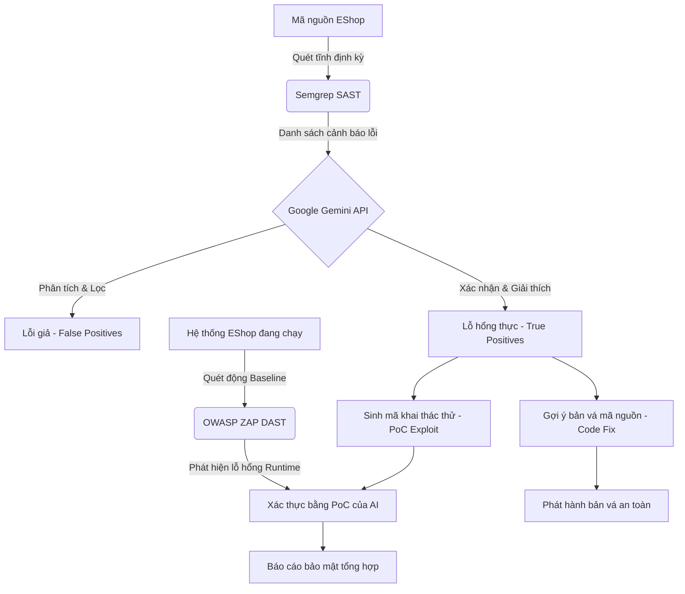

# LUỒNG HOẠT ĐỘNG KIỂM THỬ BẢO MẬT (SECURITY TESTING WORKFLOW)

Tài liệu này mô tả chi tiết quy trình kết hợp các công cụ kiểm thử bảo mật (Semgrep, AI Assist, và OWASP ZAP) được nhóm đề xuất áp dụng cho hệ thống EShop.

## 1. Sơ đồ quy trình tổng quan

## 2. Diễn giải chi tiết các bước

### Bước 1: Quét mã nguồn tĩnh (SAST) bằng Semgrep
- **Mục tiêu:** Rà soát lỗ hổng ở mức source code trước khi ứng dụng được triển khai.
- **Hoạt động:** 
  - Đưa mã nguồn của hệ thống EShop (có chứa các lỗ hổng mẫu như SQL Injection, Weak Hashing) qua Semgrep.
  - Semgrep sử dụng bộ ruleset chuẩn (OWASP Top 10) để phân tích cú pháp và luồng dữ liệu (data flow) nhằm tìm kiếm các đoạn code rủi ro.
- **Đầu ra:** Danh sách các cảnh báo bảo mật. (Tuy nhiên, có thể bao gồm nhiều lỗi giả - false positives - do công cụ chưa hiểu hết ngữ cảnh toàn cục của ứng dụng).

### Bước 2: Triage và Phân tích bằng AI (AI-Augmented)
- **Mục tiêu:** Giảm thiểu False-Positive và gia tăng sự hiểu biết về lỗ hổng.
- **Hoạt động:**
  - **Triage (Lọc lỗi):** Cung cấp kết quả (JSON) từ Semgrep kèm đoạn code của EShop cho Google Gemini thông qua API. AI đóng vai trò phân tích bối cảnh để loại bỏ các cảnh báo không có khả năng bị khai thác thực tế.
  - **Phân tích sâu:** AI giải thích cơ chế dẫn đến lỗ hổng bằng ngôn ngữ tự nhiên.
  - **Hỗ trợ kiểm thử:** AI tự động sinh ra kịch bản hoặc đoạn mã khai thác mẫu (PoC - Proof of Concept) phục vụ cho việc kiểm chứng thực tế.
  - **Gợi ý sửa chữa:** AI cung cấp đoạn code đã được vá an toàn.
- **Đầu ra:** Danh sách lỗ hổng đã được xác thực (True Positives), kịch bản PoC và gợi ý bản vá code.

### Bước 3: Kiểm chứng động (DAST) bằng OWASP ZAP
- **Mục tiêu:** Khẳng định xem lỗ hổng trong code có thể thực sự bị khai thác từ góc độ người dùng bên ngoài hay không.
- **Hoạt động:** 
  - Khởi chạy hệ thống EShop trong môi trường thử nghiệm.
  - Sử dụng OWASP ZAP rà quét thụ động (Passive) và chủ động (Active) vào các endpoint như form đăng nhập, trang giỏ hàng, thanh tìm kiếm.
- **Đầu ra:** Kết quả đối chiếu với cảnh báo từ SAST. ZAP sẽ giúp chỉ ra những lỗ hổng lộ diện trực tiếp trên giao diện hoặc qua API trả về.

### Bước 4: Đối chiếu chéo và Vá lỗi (Patching)
- **Mục tiêu:** Hoàn thiện quy trình báo cáo và khắc phục.
- **Hoạt động:**
  - Kiểm thử viên (Tester) sử dụng PoC do AI sinh ra để thực hiện tấn công giả lập trên hệ thống EShop đang chạy.
  - So sánh kết quả khai thác thực tế bằng PoC với cảnh báo của ZAP và Semgrep để kết luận lỗ hổng.
  - Sau khi xác nhận thành công, team sử dụng đoạn code gợi ý của AI để vá lỗi (apply patch) ngay trên source code EShop.
- **Đầu ra:** Lỗ hổng được khắc phục triệt để; hoàn tất tài liệu chứng minh và báo cáo kiểm thử.
