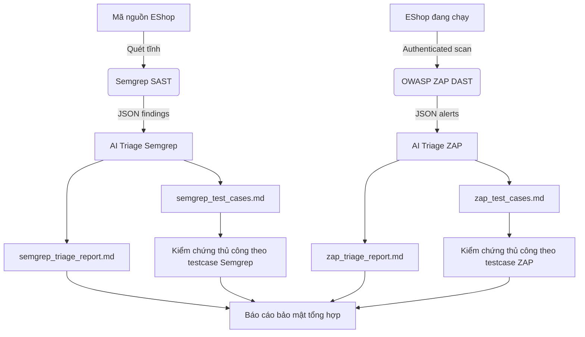

# LUỒNG HOẠT ĐỘNG KIỂM THỬ BẢO MẬT (SECURITY TESTING WORKFLOW)

Tài liệu này mô tả quy trình kiểm thử bảo mật của nhóm cho hệ thống EShop với hai nhánh tách biệt: Semgrep cho SAST và OWASP ZAP cho DAST. Mỗi nhánh đều có bước AI triage và sinh testcase riêng để phục vụ kiểm chứng thủ công.

## 1. Sơ đồ quy trình tổng quan

```mermaid
graph TD
    A[Mã nguồn EShop] -->|Quét tĩnh| B(Semgrep SAST)
    B -->|JSON findings| C[AI Triage Semgrep]
    C --> D[semgrep_triage_report.md]
    C --> E[semgrep_test_cases.md]
    E --> F[Kiểm chứng thủ công theo testcase Semgrep]

    G[EShop đang chạy] -->|Authenticated scan| H(OWASP ZAP DAST)
    H -->|JSON alerts| I[AI Triage ZAP]
    I --> J[zap_triage_report.md]
    I --> K[zap_test_cases.md]
    K --> L[Kiểm chứng thủ công theo testcase ZAP]

    D --> M[Báo cáo bảo mật tổng hợp]
    F --> M
    J --> M
    L --> M
```

## 2. Diễn giải chi tiết các bước

### Bước 1: Quét mã nguồn tĩnh (SAST) bằng Semgrep
- **Mục tiêu:** Rà soát lỗ hổng ở mức source code trước khi ứng dụng được triển khai.
- **Hoạt động:** 
  - Đưa mã nguồn EShop qua Semgrep với ruleset chính `p/owasp-top-ten`.
  - Xuất kết quả scan ra JSON để làm đầu vào cho bước AI triage.
- **Đầu ra:** File JSON findings thô từ Semgrep.

### Bước 2: AI triage cho nhánh Semgrep
- **Mục tiêu:** Phân loại finding của Semgrep, giải thích root cause và sinh testcase kiểm chứng riêng cho từng finding.
- **Hoạt động:**
  - Cung cấp JSON findings của Semgrep kèm source context cho script AI triage.
  - AI phân loại finding theo `True Positive`, `False Positive` hoặc `Needs Human Review`.
  - AI sinh báo cáo triage tổng hợp và file testcase riêng cho từng finding.
  - Với các finding quan trọng, AI có thể gợi ý PoC hoặc hướng khắc phục để tester/dev tham khảo.
- **Đầu ra:** `semgrep_triage_report.md`, `semgrep_test_cases.md`, và các file phân tích per-finding.

### Bước 3: Quét động (DAST) bằng OWASP ZAP
- **Mục tiêu:** Thu thập runtime evidence từ ứng dụng đang chạy qua request/response thực tế.
- **Hoạt động:** 
  - Khởi chạy hệ thống EShop trong môi trường thử nghiệm.
  - Dùng OWASP ZAP GUI khi cần quan sát proxy, context và authentication flow.
  - Dùng ZAP CLI theo authenticated scan để giảm rủi ro thao tác login sai lặp lại và giữ đúng ngữ cảnh user/admin cần kiểm thử.
  - Xuất report JSON từ ZAP để đưa sang bước AI triage của nhánh DAST.
- **Đầu ra:** File JSON alerts từ ZAP với runtime evidence tương ứng.

### Bước 4: AI triage cho nhánh ZAP
- **Mục tiêu:** Gom nhóm alert runtime, giải thích ý nghĩa bảo mật và sinh testcase replay riêng cho từng alert group.
- **Hoạt động:**
  - Cung cấp report JSON của ZAP cho script AI triage.
  - AI gom các alert instance thành alert group, giữ lại runtime evidence đại diện và phân loại từng nhóm alert.
  - AI sinh testcase replay cho từng endpoint/request instance trong `zap_test_cases.md`.
- **Đầu ra:** `zap_triage_report.md`, `zap_test_cases.md`, và các file phân tích per-alert.

### Bước 5: Kiểm chứng thủ công và tổng hợp báo cáo
- **Mục tiêu:** Xác nhận finding/alert bằng testcase đúng với từng nhánh và hoàn thiện báo cáo cuối.
- **Hoạt động:**
  - Tester chạy testcase từ `semgrep_test_cases.md` để kiểm chứng finding của nhánh SAST.
  - Tester chạy testcase từ `zap_test_cases.md` để replay runtime evidence của nhánh DAST.
  - Ghi nhận kết quả kiểm chứng thủ công, mức độ ảnh hưởng và trạng thái cuối cùng.
  - Developer dùng kết quả đã được kiểm chứng để sửa lỗi, bổ sung test, và rà lại sau khi vá.
- **Đầu ra:** Báo cáo bảo mật tổng hợp, evidence kiểm chứng thủ công, và trạng thái xử lý của từng finding/alert.
