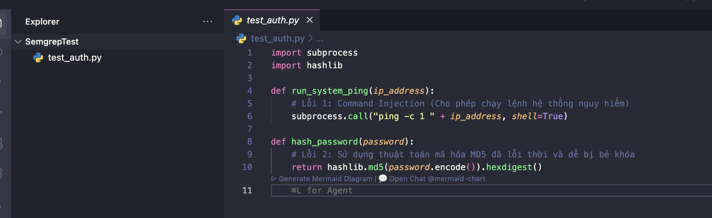
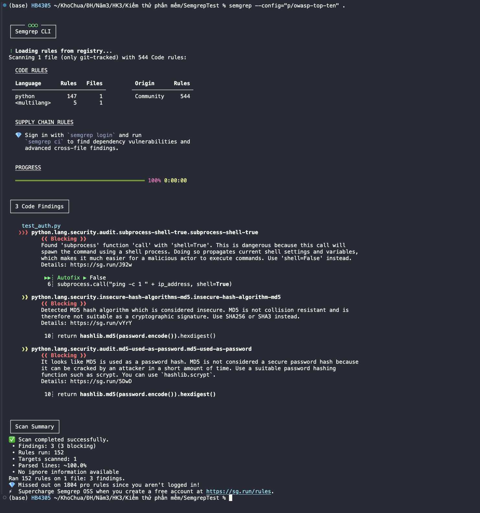

# Pha 1 Track A: Semgrep Flow & AI Triage Template

## 1. M1 - Setup & Hello World

### Setup Notes
- **Môi trường / Hệ điều hành:** macOS
- **Cách cài đặt:**
  ```bash
  brew install semgrep
  ```
### Hello World / Quick Start
- **Lệnh chạy thử:**
  ```bash
  semgrep scan --config "p/owasp-top-ten" <đường_dẫn_đến_source_code>
  ```
- **Kết quả (Screenshot hoặc Output log):**
  
  

---

## 2. Pha 1 - Semgrep Finding Note

- **Mục tiêu scan:** EShop repo (backend)
- **Lệnh scan thực tế:**
  ```bash
  semgrep scan --config "p/owasp-top-ten" --json -o semgrep_results.json .
  ```
- **Chi tiết lỗi được chọn (The Finding):**
  - **Rule ID:** javascript.jsonwebtoken.security.jwt-hardcode.hardcoded-jwt-secret
  - **Mức độ (Severity):** WARNING
  - **File:** backend/server.js
  - **Dòng code (Line):** 51
  - **Mô tả của công cụ:** A hard-coded credential was detected. It is not recommended to store credentials in source-code, as this risks secrets being leaked and used by either an internal or external malicious adversary. It is recommended to use environment variables to securely provide credentials or retrieve credentials from a secure vault or HSM (Hardware Security Module).
  - **Đoạn code bị lỗi (Source evidence):**
    ```javascript
    const token = jwt.sign({ id: user.id, role: user.role }, SECRET_KEY);
    // (Với SECRET_KEY = "super_secret_key_that_should_not_be_here" được hardcode ở dòng 9)
    ```

---

## 3. Pha 1 - AI Triage Note

### Prompt sử dụng
*Hãy ghi lại câu lệnh bạn đã dùng để hỏi AI (Gemini).*
> **Prompt:** Tôi dùng công cụ Semgrep (SAST) để quét mã nguồn và phát hiện một lỗ hổng bảo mật. Thông tin kỹ thuật trích xuất từ Semgrep: Rule ID: javascript.jsonwebtoken.security.jwt-hardcode.hardcoded-jwt-secret, Tệp tin: backend/server.js, Dòng: 51, Cảnh báo: A hard-coded credential was detected... Hãy cung cấp báo cáo đánh giá (Giải thích, PoC, Impact, Remediation).

### Phản hồi của AI (Tóm tắt)
- **Giải thích lỗi:** Lỗ hổng xảy ra khi khóa bí mật (SECRET_KEY) dùng để ký JWT Token được ghi trực tiếp (hardcode) vào mã nguồn. Ai đọc được code cũng sẽ biết key này, dẫn đến việc token bị mất tác dụng bảo mật.
- **PoC do AI tạo:**
  ```javascript
  const jwt = require('jsonwebtoken');
  const leakedSecret = 'super_secret_key_that_should_not_be_here';
  
  const maliciousPayload = {
    id: 1, // Giả mạo ID của Admin
    role: 'admin',
    iat: Math.floor(Date.now() / 1000)
  };
  // Tạo token giả mạo với toàn quyền admin
  const forgedToken = jwt.sign(maliciousPayload, leakedSecret);
  ```
- **Cách fix do AI tạo:**
  ```javascript
  require('dotenv').config();
  const jwt = require('jsonwebtoken');
  
  // Đọc secret key từ file biến môi trường (.env) thay vì ghi trực tiếp vào code
  const JWT_SECRET = process.env.JWT_SECRET;
  
  // Thay thế biến SECRET_KEY bằng JWT_SECRET khi ký token
  const token = jwt.sign({ id: user.id, role: user.role }, JWT_SECRET);
  ```

### AI Audit (Kiểm chứng kết quả của AI)
- [x] Lời giải thích của AI có đúng với bối cảnh dự án không? **Có. Việc hardcode chuỗi "super_secret_key_that_should_not_be_here" trong file server.js (Node.js) cực kỳ nguy hiểm, ai có source code cũng có thể tự tạo token mạo danh người khác.**
- [x] PoC có thực tế và áp dụng được vào app không? **Có. Nếu dùng đoạn PoC sinh ra token giả mạo này, ta có thể gửi request lên các API của Admin (ví dụ API sửa/xóa user) mà không cần đăng nhập thực tế.**
- [x] Đoạn code fix có giải quyết được vấn đề mà không làm hỏng tính năng (hallucination) không? **Đúng, phương pháp đưa Secret ra biến môi trường (`process.env`) là cách làm chuẩn mực nhất của Node.js.**

---

## 4. Pha 1 - Finding Report Template (Source-level)

*Mẫu report này có thể dùng lại cho các case ở Pha 2.*

### Tiêu đề lỗi: Hardcoded JWT Secret Key in Backend API
- **Người báo cáo:** Lê Mai Hoài Bảo
- **Công cụ phát hiện:** Semgrep (SAST)
- **CWE / OWASP Category:** CWE-798: Use of Hard-coded Credentials / OWASP A07:2021 - Identification and Authentication Failures

### Mô tả chi tiết (Description)
Ứng dụng backend Node.js đang lưu trữ trực tiếp chuỗi bí mật (Secret Key) dùng để ký JWT Token vào trong mã nguồn (file `backend/server.js`, dòng 9 và gọi ở dòng 51). Bất kỳ cá nhân nào có quyền xem source code (developer, QA, tester, người nhặt được file backup) đều có thể thu thập được khóa này.

### Bằng chứng (Evidence / Reproducer)
- **Source Code Evidence:**
  ```javascript
  // backend/server.js
  const SECRET_KEY = "super_secret_key_that_should_not_be_here"; // Lộ ở dòng 9
  ...
  const token = jwt.sign({ id: user.id, role: user.role }, SECRET_KEY); // Gọi ở dòng 51
  ```
- **PoC (Proof of Concept):**
  Một kẻ xấu có mã nguồn sẽ tạo file `exploit.js` với nội dung sau:
  ```javascript
  const jwt = require('jsonwebtoken');
  const forgedToken = jwt.sign({ id: 1, role: 'admin' }, "super_secret_key_that_should_not_be_here");
  console.log("Token giả mạo:", forged doToken);
  ```
  Sau đó mang `forgedToken` này gán vào header `Authorization: Bearer <token>` để chiếm quyền Admin trên app EShop.

### Mức độ ảnh hưởng (Impact)
**NGHIÊM TRỌNG (HIGH/CRITICAL)**. Lỗ hổng dẫn đến Authentication Bypass (vượt qua xác thực) và Privilege Escalation (leo thang đặc quyền). Hacker chiếm toàn quyền kiểm soát dữ liệu, sửa đổi đơn hàng, thêm xoá tài khoản trái phép.

### Khuyến nghị khắc phục (Remediation)
- **Cách sửa lỗi:** Không lưu trữ Secret trong mã nguồn. Cần di chuyển `SECRET_KEY` sang cấu hình biến môi trường (`.env`).
  ```javascript
  // 1. Cài đặt thư viện: npm install dotenv
  // 2. Tạo file .env chứa: JWT_SECRET="chuỗi_rất_dài_và_phức_tạp"
  // 3. Cập nhật server.js:
  require('dotenv').config();
  const SECRET_KEY = process.env.JWT_SECRET;
  
  if(!SECRET_KEY) {
      console.error("Thiếu JWT_SECRET trong môi trường!");
      process.exit(1);
  }
  ```
