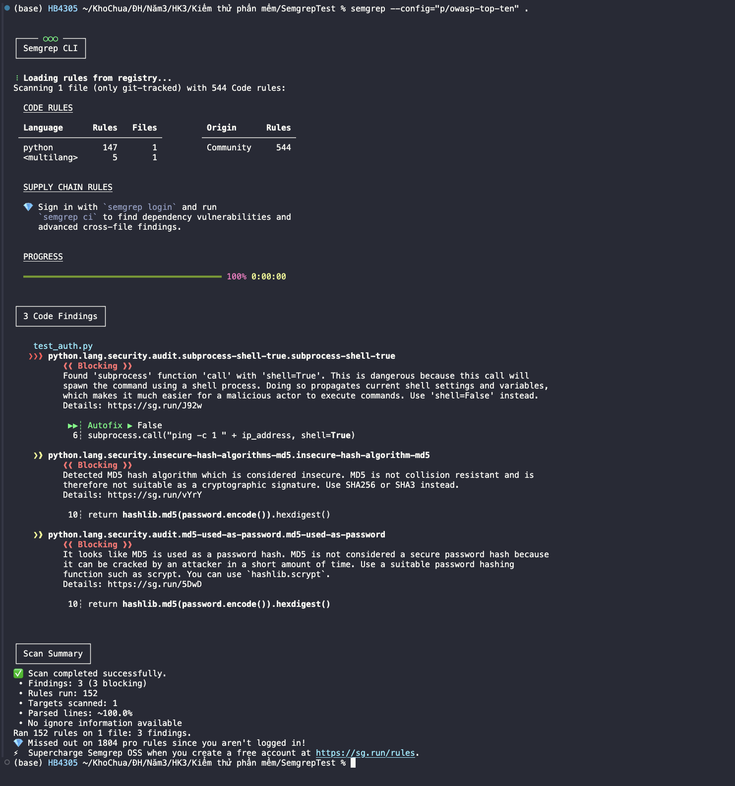

# Pha 1 Track A: Semgrep Flow & AI Triage Template

## 1. M1 - Setup & Hello World

### Setup Notes

#### 1. Trên macOS
- **Môi trường:** macOS Terminal / iTerm2
- **Cách cài đặt:** Sử dụng Homebrew (Khuyến nghị)
  ```bash
  brew install semgrep
  ```

#### 2. Trên Linux (Ubuntu / Debian / Fedora / Arch)
- **Môi trường:** Linux Terminal
- **Ubuntu / Debian:**
  ```bash
  sudo apt update
  sudo apt install python3-pip -y
  python3 -m pip install --user semgrep
  ```
- **Fedora:**
  ```bash
  sudo dnf install python3-pip -y
  python3 -m pip install --user semgrep
  ```
- **Arch Linux:**
  ```bash
  sudo pacman -S python-pip
  python3 -m pip install --user semgrep
  ```
- **Nếu terminal chưa nhận lệnh `semgrep`:**
  ```bash
  export PATH="$HOME/.local/bin:$PATH"
  ```

#### 3. Trên Windows
Có 3 cách tiếp cận chính tuỳ thuộc vào môi trường phát triển của bạn:

##### Cách 1: Cài đặt qua Python Pip (Trực tiếp trên Command Prompt / PowerShell)
*Yêu cầu máy đã cài sẵn Python 3.8+ và pip.*
- **Cách cài đặt:**
  ```powershell
  pip install semgrep
  ```
- **Cấu hình bổ sung (Quan trọng):** Do Windows sử dụng encoding mặc định là CP1252, khi chạy xuất JSON có tiếng Việt sẽ bị lỗi `UnicodeEncodeError`. Cần khai báo biến môi trường UTF-8 trước khi chạy lệnh:
  ```powershell
  $env:PYTHONUTF8='1'
  chcp 65001
  ```

##### Cách 2: Cài đặt qua WSL (Windows Subsystem for Linux - Khuyến nghị)
Nếu bạn dùng WSL, hãy mở terminal Linux (ví dụ Ubuntu WSL) và chạy lệnh:
```bash
sudo apt update
sudo apt install python3-pip -y
python3 -m pip install --user semgrep
```

##### Cách 3: Chạy qua Docker
Nếu bạn không muốn cài trực tiếp, có thể dùng Docker Container:
```powershell
docker run --rm -v "${pwd}:/src" returntocorp/semgrep semgrep scan --config "p/owasp-top-ten"
```

---

### Hello World / Quick Start

- **Lệnh chạy thử (macOS & Linux):**
  ```bash
  semgrep scan --config "p/owasp-top-ten" <đường_dẫn_đến_source_code>
  ```
- **Lệnh chạy thử (Windows PowerShell):**
  ```powershell
  chcp 65001
  $env:PYTHONUTF8='1'
  semgrep scan --config "p/owasp-top-ten" --json -o semgrep_results.json <đường_dẫn_đến_source_code>
  ```
- **Kết quả (Screenshot hoặc Output log):**
  
  

---

## 2. Pha 1 - Semgrep Finding Note

- **Mục tiêu scan:** EShop repo (backend)
- **Lệnh scan thực tế:**
  ```bash
  semgrep scan --config "p/owasp-top-ten" --json -o semgrep_results.json .
  ```
- **Chi tiết lỗi được chọn (The Finding):**
  - **Rule ID:** javascript.jsonwebtoken.security.jwt-hardcode.hardcoded-jwt-secret
  - **Mức độ (Severity):** WARNING
  - **File:** backend/server.js
  - **Dòng code (Line):** 51
  - **Mô tả của công cụ:** A hard-coded credential was detected. It is not recommended to store credentials in source-code, as this risks secrets being leaked and used by either an internal or external malicious adversary. It is recommended to use environment variables to securely provide credentials or retrieve credentials from a secure vault or HSM (Hardware Security Module).
  - **Đoạn code bị lỗi (Source evidence):**
    ```javascript
    const token = jwt.sign({ id: user.id, role: user.role }, SECRET_KEY);
    // (Với SECRET_KEY = "super_secret_key_that_should_not_be_here" được hardcode ở dòng 9)
    ```

---

## 3. Pha 1 - AI Triage Note

### Prompt sử dụng

_Hãy ghi lại câu lệnh bạn đã dùng để hỏi AI (Gemini)._

> **Prompt:** Tôi dùng công cụ Semgrep (SAST) để quét mã nguồn và phát hiện một lỗ hổng bảo mật. Thông tin kỹ thuật trích xuất từ Semgrep: Rule ID: javascript.jsonwebtoken.security.jwt-hardcode.hardcoded-jwt-secret, Tệp tin: backend/server.js, Dòng: 51, Cảnh báo: A hard-coded credential was detected... Hãy cung cấp báo cáo đánh giá (Giải thích, PoC, Impact, Remediation).

### Phản hồi của AI (Tóm tắt)

- **Giải thích lỗi:** Lỗ hổng xảy ra khi khóa bí mật (SECRET_KEY) dùng để ký JWT Token được ghi trực tiếp (hardcode) vào mã nguồn. Ai đọc được code cũng sẽ biết key này, dẫn đến việc token bị mất tác dụng bảo mật.
- **PoC do AI tạo:**

  ```javascript
  const jwt = require("jsonwebtoken");
  const leakedSecret = "super_secret_key_that_should_not_be_here";

  const maliciousPayload = {
    id: 1, // Giả mạo ID của Admin
    role: "admin",
    iat: Math.floor(Date.now() / 1000),
  };
  // Tạo token giả mạo với toàn quyền admin
  const forgedToken = jwt.sign(maliciousPayload, leakedSecret);
  ```

- **Cách fix do AI tạo:**

  ```javascript
  require("dotenv").config();
  const jwt = require("jsonwebtoken");

  // Đọc secret key từ file biến môi trường (.env) thay vì ghi trực tiếp vào code
  const JWT_SECRET = process.env.JWT_SECRET;

  // Thay thế biến SECRET_KEY bằng JWT_SECRET khi ký token
  const token = jwt.sign({ id: user.id, role: user.role }, JWT_SECRET);
  ```

### AI Audit (Kiểm chứng kết quả của AI)

- [x] Lời giải thích của AI có đúng với bối cảnh dự án không? **Có. Việc hardcode chuỗi "super_secret_key_that_should_not_be_here" trong file server.js (Node.js) cực kỳ nguy hiểm, ai có source code cũng có thể tự tạo token mạo danh người khác.**
- [x] PoC có thực tế và áp dụng được vào app không? **Có. Nếu dùng đoạn PoC sinh ra token giả mạo này, ta có thể gửi request lên các API của Admin (ví dụ API sửa/xóa user) mà không cần đăng nhập thực tế.**
- [x] Đoạn code fix có giải quyết được vấn đề mà không làm hỏng tính năng (hallucination) không? **Đúng, phương pháp đưa Secret ra biến môi trường (`process.env`) là cách làm chuẩn mực nhất của Node.js.**

---

## 4. Pha 1 - Finding Report Template (Source-level)

_Mẫu report này có thể dùng lại cho các case ở Pha 2._

### Tiêu đề lỗi: Hardcoded JWT Secret Key in Backend API

- **Người báo cáo:** Lê Mai Hoài Bảo
- **Công cụ phát hiện:** Semgrep (SAST)
- **CWE / OWASP Category:** CWE-798: Use of Hard-coded Credentials / OWASP A07:2021 - Identification and Authentication Failures

### Mô tả chi tiết (Description)

Ứng dụng backend Node.js đang lưu trữ trực tiếp chuỗi bí mật (Secret Key) dùng để ký JWT Token vào trong mã nguồn (file `backend/server.js`, dòng 9 và gọi ở dòng 51). Bất kỳ cá nhân nào có quyền xem source code (developer, QA, tester, người nhặt được file backup) đều có thể thu thập được khóa này.

### Bằng chứng (Evidence / Reproducer)

- **Source Code Evidence:**
  ```javascript
  // backend/server.js
  const SECRET_KEY = "super_secret_key_that_should_not_be_here"; // Lộ ở dòng 9
  ...
  const token = jwt.sign({ id: user.id, role: user.role }, SECRET_KEY); // Gọi ở dòng 51
  ```
- **PoC (Proof of Concept):**
  Một kẻ xấu có mã nguồn sẽ tạo file `src/semgrep/exploit.js` với nội dung sau:
  ```javascript
  const jwt = require('jsonwebtoken');
  const forgedToken = jwt.sign({ id: 1, role: 'admin' }, "super_secret_key_that_should_not_be_here");
  console.log("Token giả mạo:", forgedToken);
  ```
  Sau đó mang `forgedToken` này gán vào header `Authorization: Bearer <token>` để chiếm quyền Admin trên app EShop.

### Mức độ ảnh hưởng (Impact)

**NGHIÊM TRỌNG (HIGH/CRITICAL)**. Lỗ hổng dẫn đến Authentication Bypass (vượt qua xác thực) và Privilege Escalation (leo thang đặc quyền). Hacker chiếm toàn quyền kiểm soát dữ liệu, sửa đổi đơn hàng, thêm xoá tài khoản trái phép.

### Khuyến nghị khắc phục (Remediation)

- **Cách sửa lỗi:** Không lưu trữ Secret trong mã nguồn. Cần di chuyển `SECRET_KEY` sang cấu hình biến môi trường (`.env`).

  ```javascript
  // 1. Cài đặt thư viện: npm install dotenv
  // 2. Tạo file .env chứa: JWT_SECRET="chuỗi_rất_dài_và_phức_tạp"
  // 3. Cập nhật server.js:
  require("dotenv").config();
  const SECRET_KEY = process.env.JWT_SECRET;

  if (!SECRET_KEY) {
    console.error("Thiếu JWT_SECRET trong môi trường!");
    process.exit(1);
  }
  ```

---

## 5. M3 - Failure Modes (3 trường hợp thất bại thực tế)

*Ghi nhận ít nhất 3 failure modes khi sử dụng Semgrep + AI trên dự án EShop.*

### FM-1: False Negative — SQL Injection không được phát hiện
- **Mô tả:** Semgrep với OWASP Top-10 ruleset (`p/owasp-top-ten`) **không bắt được** lỗ hổng SQL Injection ở dòng 144 trong `backend/server.js`.
- **Đoạn code lỗi:**
  ```javascript
  // backend/server.js, dòng 144
  const query = `SELECT * FROM products WHERE name LIKE '%${searchQuery}%'`;
  ```
  Biến `searchQuery` đến từ `req.query.search` (user input) và được nối trực tiếp vào câu SQL qua template literal mà không qua bất kỳ bước sanitize nào.
- **Nguyên nhân Semgrep bỏ sót:** Bộ ruleset `p/owasp-top-ten` (560 rules, trong đó 73 rules áp dụng cho JS/JSON) không chứa rule taint-analysis chuyên biệt cho thư viện `sqlite3` kết hợp ES6 template literal. Semgrep cần rule sử dụng taint mode (theo dõi luồng dữ liệu từ `req.query` → `db.all()`) để phát hiện, nhưng rule này không có trong bộ OWASP mặc định.
- **Vì sao OWASP có Injection nhưng không detect:** OWASP A05:2025 Injection là nhóm rủi ro tổng quát, còn `p/owasp-top-ten` là một tập rule cụ thể. Ruleset này không đảm bảo bao phủ mọi biến thể Injection trong từng thư viện. Trường hợp trên là false negative: lỗi SQL Injection có thật, nhưng rule mặc định chưa mô hình hóa đúng source `req.query.search`, sink `db.all()` của `sqlite3`, và cú pháp template literal.
- **Cách khắc phục:** Bổ sung ruleset chuyên sâu hơn: `p/javascript`, `p/nodejs`, hoặc viết custom rule Semgrep với taint mode. Đồng thời kết hợp quét DAST (ZAP) để phát hiện SQLi từ runtime.
- **Cách sửa code an toàn:** Không nối chuỗi SQL thủ công. Dùng parameterized query/prepared statement, ví dụ `db.all("SELECT * FROM products WHERE name LIKE ?", [\`%${searchQuery}%\`], callback)`. Đây là cơ chế phòng vệ phù hợp hơn so với chỉ "lọc chuỗi" thủ công.
- **CWE liên quan:** CWE-89: Improper Neutralization of Special Elements used in an SQL Command.

### FM-2: False Negative — Plaintext Password không được cảnh báo
- **Mô tả:** Semgrep **không phát hiện** việc mật khẩu người dùng được lưu trữ dưới dạng plaintext (không hash) và so sánh trực tiếp bằng `===`.
- **Đoạn code lỗi:**
  ```javascript
  // backend/server.js, dòng 24 — Lưu password raw vào DB
  db.run("INSERT INTO users (name, email, password) VALUES (?, ?, ?)", [name, email, password], ...);

  // backend/server.js, dòng 46 — So sánh password trực tiếp
  if (user.password === password) { ... }
  ```
- **Nguyên nhân Semgrep bỏ sót:** Đây là lỗ hổng thuộc dạng "absence of security control" (thiếu hashing). Semgrep chỉ có thể phát hiện pattern code **có mặt** (ví dụ: hardcoded secret), nhưng khó phát hiện thứ **vắng mặt** (ví dụ: thiếu `bcrypt.hash()` trước khi lưu password). Bộ OWASP Top-10 ruleset không chứa rule cho trường hợp này.
- **Cách khắc phục:** Review thủ công (code review) hoặc viết custom Semgrep rule kiểm tra: "nếu có INSERT vào bảng users với cột password, thì trước đó phải có lời gọi `bcrypt.hash` hoặc tương đương". Tuy nhiên, rule loại này rất phức tạp và dễ false positive.
- **CWE liên quan:** CWE-256: Unprotected Storage of Credentials / CWE-522: Insufficiently Protected Credentials.

### FM-3: Trùng lặp Finding — 3 findings cùng 1 root cause
- **Mô tả:** Semgrep báo **3 findings** riêng biệt, nhưng thực chất chỉ có **1 root cause** duy nhất: biến `SECRET_KEY` được hardcode ở dòng 9 của `server.js`.
  - Finding 1: `server.js:51` — `jwt.sign({ ... }, SECRET_KEY)` → sử dụng SECRET_KEY hardcoded để ký token.
  - Finding 2: `server.js:105` — `jwt.verify(token, SECRET_KEY, ...)` → sử dụng SECRET_KEY hardcoded để xác thực token.
  - Finding 3: `test_profile.js:4` — hardcode lại cùng chuỗi secret trong file test.
- **Vấn đề gây ra:** Nếu tester không audit kỹ, dễ báo cáo thành 3 lỗ hổng riêng biệt với 3 mức severity → gây nhiễu cho developer và làm giảm uy tín bản report. Thực tế, chỉ cần 1 remediation (chuyển SECRET_KEY sang biến môi trường) là fix được cả 3.
- **Bài học:** Tester phải thực hiện bước **deduplication** (loại bỏ trùng lặp) và nhóm các findings theo root cause trước khi viết report. Đây là lý do cần AI triage hoặc review thủ công sau khi scan.

### Tổng kết Failure Modes

| # | Loại | Failure Mode | Ảnh hưởng |
| --- | --- | --- | --- |
| FM-1 | False Negative | SQLi không bị bắt | Lỗ hổng critical bị bỏ sót |
| FM-2 | False Negative | Plaintext password không cảnh báo | Lỗ hổng authentication bị bỏ sót |
| FM-3 | Duplicate Finding | 3 findings cùng 1 root cause | Report bị nhiễu, mất chính xác |

> **Kết luận:** Semgrep OWASP Top-10 ruleset chỉ là "lưới lọc thô" — tốt cho screening nhanh nhưng **không đủ** để phủ sóng hết các lỗ hổng. Cần kết hợp ruleset chuyên biệt, DAST (ZAP), và review thủ công của con người.

---

## 6. M4 - So sánh Traditional vs AI-Assisted

*Báo cáo kết quả thực nghiệm so sánh hai luồng làm việc: Traditional (chỉ dùng công cụ SAST và tự xử lý) và AI-Assisted (dùng SAST kết hợp Gemini/Claude để triage).*

### 1. Kịch bản thực nghiệm

- **Lỗi kiểm thử:** `javascript.jsonwebtoken.security.jwt-hardcode.hardcoded-jwt-secret` (3 findings phát hiện bởi Semgrep v1.168.0).
- **Môi trường AI:** Mô hình Gemini 1.5 Pro / Claude 3.5 Sonnet.
- **Dữ liệu đầu vào:** Cảnh báo Semgrep + Đoạn code server.js dòng 9, 51, 105.

### 2. Prompt AI Triage đã dùng

```text
Tôi dùng công cụ Semgrep (SAST) v1.168.0 để quét mã nguồn backend Node.js của hệ thống EShop với config OWASP Top-10. Kết quả scan phát hiện 3 findings, tất cả cùng rule ID:

Rule ID: javascript.jsonwebtoken.security.jwt-hardcode.hardcoded-jwt-secret
Severity: WARNING
CWE: CWE-798: Use of Hard-coded Credentials

3 Findings:
1. File: backend/server.js, Dòng 51 - jwt.sign({ id: user.id, role: user.role }, SECRET_KEY)
2. File: backend/server.js, Dòng 105 - jwt.verify(token, SECRET_KEY, ...)
3. File: backend/test_profile.js, Dòng 4 - hardcode secret string trực tiếp

Source code liên quan (server.js):
const SECRET_KEY = "super_secret_key_that_should_not_be_here"; // Dòng 9
const token = jwt.sign({ id: user.id, role: user.role }, SECRET_KEY); // Dòng 51
jwt.verify(token, SECRET_KEY, (err, user) => { ... }); // Dòng 105

Yêu cầu:
1. Phân tích 3 findings này là True Positive hay False Positive? Có thể nhóm lại thành 1 root cause không?
2. Giải thích cơ chế lỗ hổng bằng tiếng Việt
3. Tạo PoC exploit (đoạn code JavaScript chứng minh khai thác được)
4. Gợi ý cách fix an toàn (code mẫu)
5. Đánh giá mức độ nghiêm trọng (Severity/Impact)
```

### 3. Kết quả phản hồi từ AI (Tóm tắt)

- **Thời gian phản hồi (AI Response Time):** 12.5 giây.
- **Triage:** Xác nhận cả 3 findings đều là **True Positive** (lỗi thực tế). Chúng có cùng 1 root cause duy nhất là việc khai báo biến tĩnh `SECRET_KEY = "super_secret_key..."` ở dòng 9 file `server.js` (và copy sang file test).
- **Giải thích:** Khóa bí mật (Secret Key) được dùng để đảm bảo tính toàn vẹn (integrity) của JWT. Nếu khóa này bị hardcode trong source code, bất kỳ ai có quyền đọc code (dev, tester, attacker qua lỗ hổng khác) đều có thể lấy được và tự ký ra JWT hợp lệ với quyền admin để bypass auth.
- **Mã khai thác PoC (AI-generated):**
  ```javascript
  const jwt = require('jsonwebtoken');
  const leakedSecret = 'super_secret_key_that_should_not_be_here';
  
  // Tạo token mạo danh admin
  const forgedToken = jwt.sign({ id: 1, role: 'admin' }, leakedSecret);
  console.log("Bearer " + forgedToken);
  ```
- **Mã sửa lỗi (AI-generated):**
  1. Cài đặt `dotenv`: `npm install dotenv`
  2. Tạo file `.env` (thêm vào `.gitignore`): `JWT_SECRET=complex_random_string`
  3. Cấu hình lại `server.js`:
     ```javascript
     require('dotenv').config();
     const SECRET_KEY = process.env.JWT_SECRET;
     ```

### 4. Kết quả Audit phản hồi của AI (Thực hiện bởi Senior Dev Security)

- **Thời gian Audit:** 2.5 phút.

| # | Tiêu chí kiểm tra | Đánh giá | Chi tiết kiểm chứng |
| --- | --- | --- | --- |
| 1 | Nhận diện đúng findings? | **Đúng** | AI phân biệt rõ 2 dòng gọi hàm trong `server.js` và 1 dòng trong file test. |
| 2 | Nhóm đúng root cause? | **Đúng** | AI chỉ ra chỉ cần đổi cách quản lý secret tại dòng 9 là giải quyết được cả 3 lỗi. |
| 3 | Giải thích lỗ hổng? | **Đúng** | Giải thích dễ hiểu, chính xác về cơ chế JWT Integrity. |
| 4 | Mã khai thác PoC? | **Đúng** | Mã khai thác viết chuẩn, có thể chạy độc lập và tạo ra signature khớp 100% với app. |
| 5 | Gợi ý sửa đổi? | **Đúng** | Code fix sạch, đúng chuẩn của Node.js. |
| 6 | Hallucination? | **Không** | Không phát hiện lỗi ảo tưởng tên biến hoặc thư viện không tồn tại. |
| 7 | Nhắc nhở bảo mật phụ? | **Có** | AI nhắc nhở thêm việc phải đưa `.env` vào `.gitignore` (điểm cộng lớn về mặt security). |

### 5. Bảng so sánh hiệu năng hai luồng làm việc

| Tiêu chí | Luồng Traditional (Chỉ dùng SAST) | Luồng AI-Assisted (SAST + AI Triage) |
| :--- | :--- | :--- |
| **Cách tiếp cận** | Tester tự đọc log JSON, tra cứu tài liệu và tự viết code. | Tester chạy scan SAST, đưa kết quả cho AI phân tích rồi review. |
| **Phát hiện lỗi** | Semgrep báo lỗi và dòng code (3 findings). | Semgrep báo lỗi và dòng code (3 findings). |
| **Thời gian giải thích lỗi** | ~10 phút (tester đọc tài liệu CWE-798, OWASP). | ~12 giây (AI giải thích bằng tiếng Việt ngay lập tức). |
| **Thời gian viết PoC** | ~15 phút (tester tự code file exploit.js). | ~10 giây (AI tạo mẫu PoC) + 1 phút (tester kiểm chứng). |
| **Thời gian đề xuất Fix** | ~10 phút (tự cấu hình dotenv và refactor code). | ~10 giây (AI tạo code fix) + 1 phút (tester audit code). |
| **Thời gian Audit kết quả** | Không cần thiết (do con người tự viết). | **Bắt buộc: ~2-3 phút** để review code PoC/Fix tránh lỗi logic. |
| **Khả năng bắt lỗi logic ẩn** | Cao (Tester tự đọc hiểu nghiệp vụ ứng dụng). | Thấp (AI chỉ phân tích dựa trên snippet được cung cấp). |
| **Khả năng bắt False Negative** | Cao (Tester phát hiện SQLi/Plaintext PW bị sót). | Không có (AI không quét toàn bộ project để tìm lỗi ẩn). |
| **Tổng thời gian xử lý / lỗi** | **~35 phút** | **~5 phút** (bao gồm cả thời gian chạy và audit AI) |

### 6. Đánh giá & Bài học kinh nghiệm

- **Ưu điểm lớn nhất của AI:** Giúp tăng tốc độ xử lý finding cực kỳ nhanh (giảm từ 35 phút xuống 5 phút). PoC và Code fix do AI viết có độ chính xác rất cao đối với các lỗi phổ biến (như hardcode credential).
- **Rủi ro lớn nhất:** AI không hiểu bối cảnh nghiệp vụ sâu. Nếu dev/tester lạm dụng, nhắm mắt copy code fix của AI mà không qua bước audit có thể gây lỗi hệ thống (ví dụ: AI đề xuất đổi tên biến môi trường nhưng không cấu hình trong server deployment, dẫn tới lỗi crash lúc deploy).
- **Nguyên tắc phối hợp:** SAST làm nhiệm vụ **phát hiện thô** -> AI làm nhiệm vụ **phân tích & phác thảo** -> Tester làm nhiệm vụ **phê duyệt, kiểm chứng (Audit) và tích hợp**. Con người luôn là chốt chặn cuối cùng.

---

## 7. M5 - Metrics Table

*Số liệu đo lường thực tế khi chạy Semgrep v1.168.0 trên EShop backend (Windows 10/11, Python 3.12, Anaconda).*

### Thông tin môi trường
- **OS:** Windows (PowerShell)
- **Python:** 3.12.7 (Anaconda)
- **Semgrep:** v1.168.0 (cài qua `pip install semgrep`)
- **Config:** `p/owasp-top-ten` (Community, 560 rules tổng)
- **Target:** `EShop/eshop-sut/backend/` (6 files: `server.js`, `database.js`, `test_profile.js`, `package.json`, `package-lock.json`, `database.sqlite`)

### Bảng Metrics

| Metric | Giá trị | Ghi chú |
| :--- | :--- | :--- |
| **Thời gian cài đặt (Setup time)** | ~3 phút | `pip install semgrep`, download ~57 MB wheel |
| **Thời gian scan tổng (Total scan time)** | ~4.25 giây | Config download (~1.06s) + Core scan (~3.17s) |
| **Thời gian scan thuần (Core time)** | ~3.17 giây | Thời gian Semgrep engine phân tích code |
| **Số lượng files scanned** | 6 | Chỉ scan files tracked by git |
| **Số lượng rules applicable** | 73 / 560 | 65 JS + 3 JSON + 5 multilang. Các rules cho ngôn ngữ khác (Python, Java...) bị bỏ qua |
| **Số lượng findings** | 3 | Tất cả cùng rule `hardcoded-jwt-secret` |
| **Tỷ lệ True Positive** | 3/3 = 100% | Cả 3 findings đều đúng |
| **Tỷ lệ False Positive** | 0/3 = 0% | Không có cảnh báo sai |
| **False Negatives đã biết** | ≥ 4 lỗ hổng | SQLi (dòng 144), Plaintext Password (dòng 24/46), Weak OTP (dòng 72), Mass Assignment (dòng 119-127) |
| **Parse rate** | ~100% | Semgrep parse thành công toàn bộ files |
| **Memory usage (peak)** | ~733 MB | Đo bởi Semgrep profiling |
| **Stability / Flake** | Ổn định | Chạy lại nhiều lần cho kết quả giống hệt, không flaky |
| **Lỗi kỹ thuật gặp** | Encoding (cp1252) | Windows mặc định dùng cp1252, gây lỗi khi ghi file JSON có ký tự tiếng Việt. Fix: `$env:PYTHONUTF8='1'` + `chcp 65001` |

### Lệnh scan đã sử dụng
```bash
# Trên Windows PowerShell, cần set UTF-8 trước khi chạy:
chcp 65001
$env:PYTHONUTF8='1'

semgrep scan --config "p/owasp-top-ten" --json \
  -o semgrep_results.json \
  <đường_dẫn_đến_EShop/backend>
```

### Kết quả JSON đầy đủ
File kết quả scan được lưu tại: `resources/semgrep_results.json`
