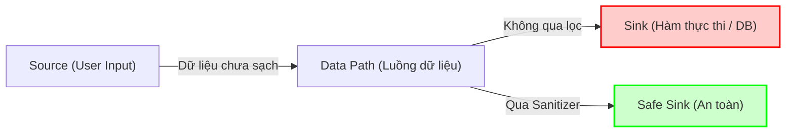

# Tài liệu Lý thuyết SAST và Semgrep

Tài liệu này cung cấp kiến thức nền tảng về Kiểm thử bảo mật tĩnh (SAST), giới thiệu về công cụ Semgrep, quy trình phân tích cảnh báo (Triage) với sự hỗ trợ của Trí tuệ nhân tạo (AI), các trường hợp thất bại thực tế (Failure Modes), và so sánh hiệu quả giữa phương pháp truyền thống với phương pháp có sự hỗ trợ của AI.

---

# 1. SAST (Static Application Security Testing)

## 1.1 Khái niệm
**Static Application Security Testing (SAST)** - Kiểm thử bảo mật ứng dụng tĩnh:
- Là một phương pháp kiểm thử bảo mật "Hộp trắng" (White-Box Testing). Thực hiện phân tích trực tiếp mã nguồn (source code), mã byte (bytecode) hoặc tệp tin cấu hình của ứng dụng khi ứng dụng ở trạng thái tĩnh (không chạy).
- Phân tích cú pháp và luồng dữ liệu từ bên trong mã nguồn để phát hiện sớm các lỗi lập trình, lỗ hổng bảo mật và các cấu hình không an toàn ngay trong chu kỳ phát triển phần mềm (SDLC).

## 1.2 Cơ chế hoạt động của SAST
Để phân tích mã nguồn hiệu quả, các công cụ SAST áp dụng các kỹ thuật sau:
1. **Phân tích cú pháp (Abstract Syntax Tree - AST):**
   - Công cụ không đọc code như văn bản thuần túy (như Regex). Thay vào đó, nó chuyển đổi mã nguồn thành một cấu trúc cây cú pháp trừu tượng (AST). Cây này đại diện cho cấu trúc ngữ pháp và logic của chương trình, giúp công cụ hiểu được biến nào, hàm nào, và cách chúng tương tác với nhau.
2. **Phân tích luồng điều khiển (Control Flow Analysis):**
   - Theo dõi thứ tự thực thi của các câu lệnh và các nhánh rẽ trong chương trình (ví dụ: `if/else`, vòng lặp) để xem dữ liệu có thể đi qua các nhánh nào.
3. **Phân tích luồng dữ liệu (Data Flow Analysis):**
   - Theo dõi đường đi của dữ liệu từ khi được định nghĩa hoặc nhận vào cho đến khi được sử dụng.
4. **Phân tích vết bẩn (Taint Analysis):**
   - Theo dõi luồng dữ liệu từ một **Nguồn (Source)** - nơi nhận dữ liệu từ người dùng (ví dụ: `req.query`) - cho tới một **Điểm đích (Sink)** - nơi dữ liệu được thực thi (ví dụ: câu lệnh truy vấn SQL `db.run()` hoặc render HTML). Nếu dữ liệu không đi qua một hàm **Lọc/Làm sạch (Sanitizer)**, công cụ sẽ cảnh báo lỗ hổng (ví dụ: SQL Injection, XSS).
   - Cần hiểu đúng "hàm lọc": không phải mọi thao tác kiểm tra chuỗi đều là sanitizer an toàn. **Validation** chỉ kiểm tra dữ liệu có đúng định dạng mong muốn hay không; **escaping/sanitization** biến đổi ký tự nguy hiểm theo từng ngữ cảnh; còn với SQL Injection, cách phòng vệ chuẩn là **parameterized query/prepared statement**, tức tách dữ liệu người dùng khỏi cấu trúc câu SQL. Vì vậy, nếu code vẫn nối trực tiếp `req.query.search` vào template literal SQL, luồng dữ liệu đó vẫn được xem là nguy hiểm dù trước đó có kiểm tra đơn giản.



## 1.3 Các lỗ hổng thường được phát hiện bằng SAST
- **Hard-coded Credentials:** Lưu trữ mật khẩu, API keys, JWT Secret trực tiếp trong mã nguồn.
- **Injection Flaws (SQLi, Command Injection):** Nối chuỗi trực tiếp đầu vào của người dùng vào các câu lệnh thực thi.
- **Insecure Cryptography:** Sử dụng các thuật toán mã hóa lỗi thời hoặc yếu (như MD5, SHA1).
- **Misconfiguration:** Các tệp tin cấu hình không an toàn (như bật chế độ debug khi chạy production, mở cổng kết nối nguy hiểm).
- **Code Quality & Bad Practices:** Các đoạn code có thể gây lỗi tràn bộ nhớ hoặc rò rỉ tài nguyên.

## 1.4 Ưu điểm và Hạn chế của SAST

### Ưu điểm:
- **Phát hiện sớm (Shift-Left Security):** Quét được ngay ở giai đoạn code, trước khi ứng dụng được deploy hoặc đóng gói.
- **Chỉ ra dòng code cụ thể:** Báo chính xác tệp tin, dòng code mắc lỗi giúp lập trình viên sửa đổi nhanh chóng.
- **Độ bao phủ cao:** Có thể quét qua 100% mã nguồn của dự án.

### Hạn chế:
- **Tỷ lệ lỗi giả (False Positives) cao:** Thường cảnh báo các đoạn code có cấu trúc giống lỗi nhưng thực tế ngữ cảnh hệ thống đã có bộ lọc bảo vệ ở cấp độ khác (ví dụ: WAF).
- **Không phát hiện được lỗi Runtime:** Không đánh giá được các lỗi cấu hình máy chủ thực tế, lỗi liên kết thư viện động hoặc lỗi phân quyền trong môi trường runtime.

---

# 2. Công cụ Semgrep

## 2.1 Khái niệm
**Semgrep** là một công cụ phân tích tĩnh (SAST) mã nguồn mở, tốc độ cao, được thiết kế để tìm kiếm lỗi bảo mật, thực thi các tiêu chuẩn code và tìm kiếm các mẫu code rủi ro. 

Điểm khác biệt của Semgrep là nó kết hợp sự đơn giản của công cụ tìm kiếm chuỗi (như `grep`) với sự thông minh về mặt ngữ nghĩa của một trình phân tích AST hoàn chỉnh.

## 2.2 Các đặc điểm và cơ chế nổi bật
- **Phân tích dựa trên Cú pháp trừu tượng (Abstract Syntax Tree):** Semgrep sử dụng **Tree-sitter** để phân tích mã nguồn thành cây AST. Nhờ đó, Semgrep hiểu được bản chất logic của mã nguồn. Ví dụ, nó hiểu rằng `foo(1, 2)` và `foo(1,   2)` hoặc các biến được đặt tên khác đi nhưng giữ nguyên cấu trúc đều có cùng bản chất ngữ nghĩa.
- **Cú pháp viết luật (Rule Syntax) cực kỳ đơn giản:** Bạn không cần phải biết viết các luật phức tạp bằng ngôn ngữ truy vấn AST chuyên sâu. Bạn chỉ cần viết luật bằng chính ngôn ngữ lập trình của mã nguồn đang quét, kết hợp với hai toán tử đặc biệt:
  - **Dấu ba chấm (`...`)**: Đại diện cho một chuỗi các đối số, các câu lệnh hoặc các ký tự bất kỳ.
  - **Biến siêu cấp (Metavariables - ví dụ `$X`)**: Dùng để khớp và lưu giữ giá trị của các biến, hàm hoặc biểu thức để đối chiếu chéo trong luật.
- **Tốc độ quét nhanh vượt trội:** Khác với các công cụ SAST truyền thống mất hàng giờ để build dự án trước khi quét, Semgrep quét trực tiếp trên mã nguồn thô với tốc độ tính bằng giây.
- **Hỗ trợ đa ngôn ngữ:** Hỗ trợ hầu hết các ngôn ngữ phổ biến hiện nay như JavaScript, TypeScript, Python, Java, Go, C#, C++, Ruby, PHP...

---

# 3. Phân tích Cảnh báo (Alert Triage) kết hợp AI

Do đặc tính của các công cụ SAST truyền thống thường sinh ra lượng cảnh báo giả (False Positive) rất lớn, quy trình làm việc hiện đại (AI-Assisted) tích hợp các mô hình ngôn ngữ lớn (LLM - ví dụ Google Gemini hoặc provider OpenAI-compatible) để hỗ trợ bộ phận bảo mật tự động hóa việc lọc và thẩm định lỗi.

```
+--------------+     JSON      +-------------------+     Prompt      +-------------------+
| Semgrep Scan | ------------> | AI Triage Script  | --------------> | Configured AI API |
|   (SAST)     |               | (Đọc lỗi & Code)  |                 |  (Model LLM)      |
+--------------+               +-------------------+                 +-------------------+
                                                                               |
                                                                               v
                                                                     +-------------------+
                                                                     | AI Triage Report  |
                                                                     |   (Markdown)      |
                                                                     +-------------------+
```

## 3.1 Quy trình thực hiện AI-Assisted Triage
1. **Quét tự động:** Chạy Semgrep và lưu kết quả dưới dạng JSON chứa đầy đủ thông tin về mã lỗi, file, dòng code, và đoạn code bị lỗi.
2. **Trích xuất ngữ cảnh:** Script Python (`semgrep_ai_triage.py`) đọc dữ liệu JSON, tách từng phát hiện bảo mật và lấy đoạn mã nguồn xung quanh.
3. **Prompting AI:** Gửi thông tin chi tiết lỗi kèm đoạn code sang mô hình Gemini với prompt yêu cầu đóng vai trò chuyên gia bảo mật để:
   - Thẩm định lỗi xem có phải lỗi thực hay không (True Positive vs False Positive).
   - Giải thích cơ chế lỗ hổng bằng tiếng Việt.
   - Viết đoạn mã khai thác mẫu (PoC) độc lập để kiểm chứng thực tế.
   - Đề xuất giải pháp và đoạn code đã vá an toàn.
4. **Lưu báo cáo:** Kết quả từ AI được lưu trực tiếp thành tệp Markdown (`AI_Triage_*.md`) làm tài liệu tham khảo cho đội ngũ phát triển và kiểm thử.

---

# 4. Các trường hợp thất bại thực tế (Failure Modes) của Semgrep

Qua thực nghiệm quét dự án EShop, nhóm đã phát hiện 3 trường hợp thất bại tiêu biểu (Failure Modes) của Semgrep:

### FM-1: False Negative — SQL Injection không được phát hiện
- **Dấu hiệu:** Semgrep sử dụng bộ luật OWASP mặc định (`p/owasp-top-ten`) hoàn toàn bỏ sót lỗ hổng SQL Injection tại dòng 144 trong file `backend/server.js`.
- **Đoạn code lỗi thực tế:**
  ```javascript
  const query = `SELECT * FROM products WHERE name LIKE '%${searchQuery}%'`;
  db.all(query, (err, rows) => { ... });
  ```
- **Nguyên nhân:** Bộ quy tắc mặc định của cộng đồng không có luật theo dõi luồng (Taint analysis) chuyên biệt cho thư viện `sqlite3` khi kết hợp với cú pháp template literal của Javascript. Semgrep không nhận diện được biến `searchQuery` bị nhiễm bẩn (tainted) từ request truyền vào điểm đích `db.all()`.
- **Giải thích câu hỏi "OWASP Top 10 có Injection nhưng sao không detect?":** OWASP A05:2025 Injection là một **nhóm rủi ro bảo mật**, còn `p/owasp-top-ten` là một **tập rule cụ thể** do Semgrep Registry cung cấp. Việc ruleset có nhãn OWASP không đảm bảo bao phủ mọi thư viện, framework và biến thể code của Injection. Trường hợp này vẫn là SQL Injection thật, nhưng là **false negative** của ruleset mặc định vì rule chưa mô hình hóa đúng cặp source/sink `req.query` -> `sqlite3 db.all()` qua template literal.
- **Giải pháp khắc phục:** Phải bổ sung các ruleset nâng cao hoặc tự viết custom ruleset sử dụng chế độ `mode: taint` để theo dõi dữ liệu đầu vào.

### FM-2: False Negative — Plaintext Password không được cảnh báo
- **Dấu hiệu:** Việc ứng dụng lưu mật khẩu người dùng dưới dạng thô (plaintext) vào database và so sánh trực tiếp bằng toán tử `===` không hề bị Semgrep cảnh báo.
- **Đoạn code lỗi thực tế:**
  ```javascript
  db.run("INSERT INTO users (name, email, password) VALUES (?, ?, ?)", [name, email, password]);
  if (user.password === password) { ... }
  ```
- **Nguyên nhân:** SAST rất mạnh trong việc tìm các cấu trúc mã nguy hiểm **hiện hữu** (như hardcode secret), nhưng rất khó phát hiện các thành phần **vắng mặt** (Absence of security control - việc thiếu hàm băm mật khẩu `bcrypt.hash`).
- **Giải pháp khắc phục:** Cần kết hợp Code Review thủ công hoặc viết custom ruleset kiểm tra sự tồn tại của hàm băm trước các câu lệnh INSERT/SELECT vào bảng users.

### FM-3: Trùng lặp cảnh báo (Duplicate Finding)
- **Dấu hiệu:** Semgrep báo cáo 3 lỗi bảo mật khác nhau trên báo cáo, nhưng thực tế cả 3 lỗi này đều chung một nguyên nhân gốc rễ (Root Cause).
- **Đoạn code lỗi thực tế:**
  - Finding 1: Khai báo `const SECRET_KEY = "super_secret_key_..."` ở dòng 9.
  - Finding 2: Gọi `jwt.sign(..., SECRET_KEY)` ở dòng 51.
  - Finding 3: Gọi `jwt.verify(..., SECRET_KEY)` ở dòng 105.
- **Ảnh hưởng:** Gây nhiễu báo cáo bảo mật, làm phóng đại số lượng lỗ hổng thực tế khiến lập trình viên mất thời gian đọc hiểu và xử lý.
- **Giải pháp khắc phục:** Sử dụng bước AI Triage hoặc bộ lọc thủ công của con người để gộp các lỗi có cùng Root Cause lại thành một và chỉ xuất một khuyến nghị sửa đổi (Remediation).

---

# 5. So sánh: Traditional (Truyền thống) vs AI-Assisted (Có AI hỗ trợ)

Dưới đây là bảng so sánh thực nghiệm thời gian và hiệu quả xử lý lỗi `hardcoded-jwt-secret` trên dự án EShop:

| Tiêu chí | Quy trình truyền thống (Chỉ dùng SAST) | Quy trình có AI hỗ trợ (SAST + AI Triage) |
| :--- | :--- | :--- |
| **Phương thức thực hiện** | Kiểm thử viên tự đọc mã nguồn lỗi, tra cứu tài liệu CWE/OWASP và tự xây dựng PoC / mã sửa lỗi. | Kiểm thử viên chạy Semgrep, đưa output JSON qua AI dịch và phân tích tự động, sau đó chỉ việc kiểm chứng lại kết quả của AI. |
| **Thời gian giải thích cơ chế lỗi** | ~10 phút (Đọc tài liệu lý thuyết). | ~12 giây (AI biên dịch sang tiếng Việt và áp dụng trực tiếp vào ngữ cảnh code dự án). |
| **Thời gian viết mã khai thác (PoC)**| ~15 phút (Code thủ công file exploit). | ~10 giây (AI viết mẫu PoC) + 1 phút (Chạy thử kiểm chứng). |
| **Thời gian thiết kế giải pháp vá lỗi**| ~10 phút (Viết lại code an toàn và cài thêm thư viện hỗ trợ cấu hình). | ~10 giây (AI sinh mã sửa lỗi đúng chuẩn chuẩn mực phát triển Node.js) + 1 phút (Audit). |
| **Thời gian Audit / Kiểm duyệt** | Không cần (do con người tự viết). | **~2-3 phút (Bắt buộc)** để kiểm tra lỗi logic và ảo tưởng (hallucination) của AI. |
| **Khả năng nhận diện lỗi nghiệp vụ**| Rất tốt (Con người hiểu rõ logic ứng dụng). | Khá hạn chế (AI chỉ phân tích dựa trên snippet code ngắn được gửi đi). |
| **Tổng thời gian xử lý / một lỗi** | **~35 phút** | **~5 phút** (Tiết kiệm đến 85% thời gian). |

---

# 6. References

- Hướng dẫn viết luật của Semgrep: https://semgrep.dev/docs/writing-rules/
- OWASP Top 10 API Security Risks: https://owasp.org/www-project-api-security/
- Static Application Security Testing (SAST) by PortSwigger: https://portswigger.net/kb/sast
