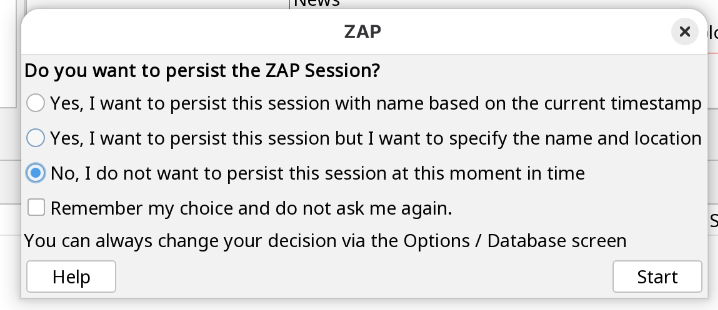
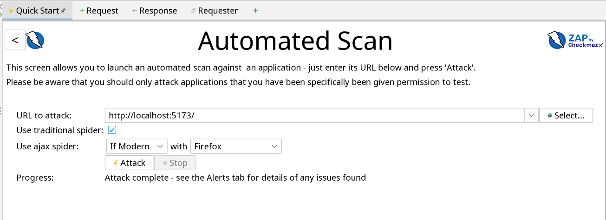
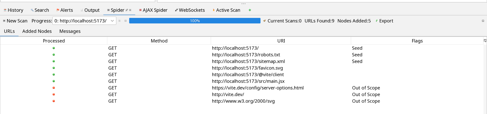
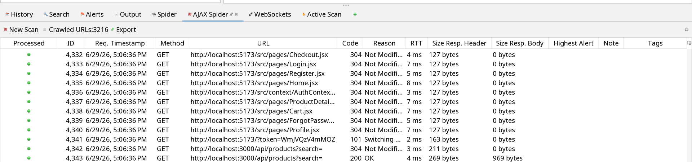
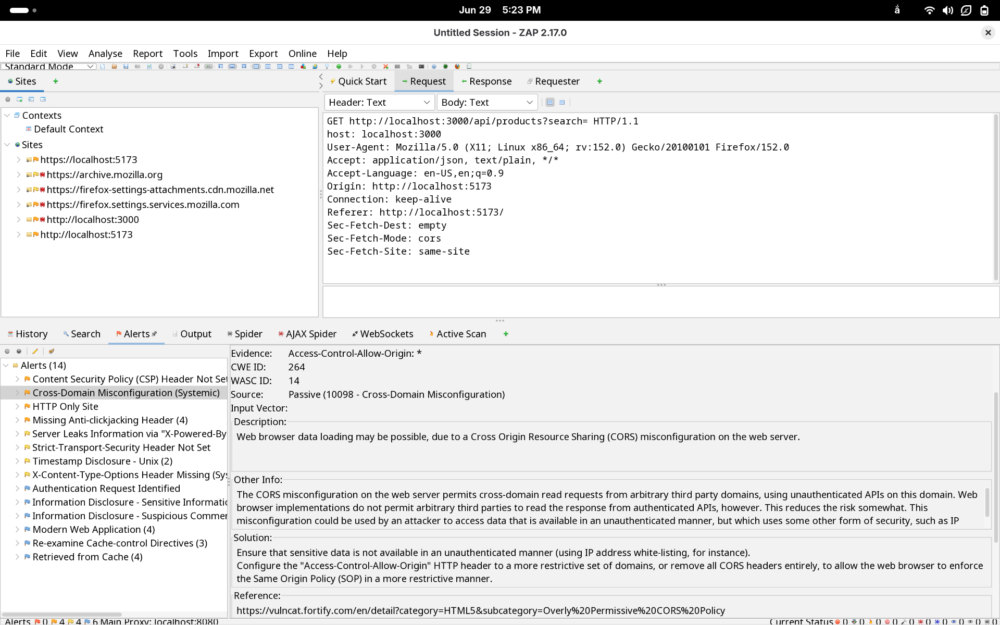
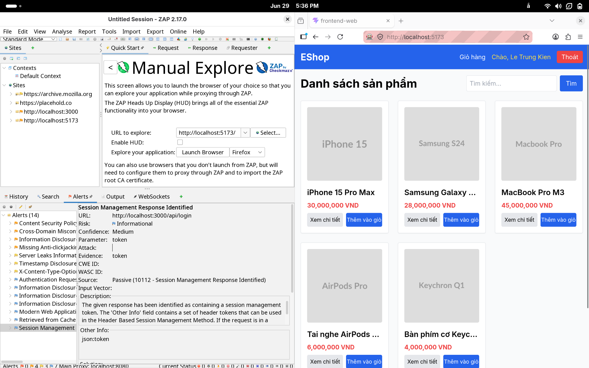

# Persisting a Session và Automated Scan trong OWASP ZAP

Dựa trên hướng dẫn chính thức của OWASP ZAP, đây là phần cơ bản giúp bạn hiểu cách lưu session và chạy scan tự động trên một ứng dụng web.

## 1. Persisting a Session (Lưu session)

Khi khởi động ZAP lần đầu, chương trình sẽ hỏi bạn có muốn lưu session hay không. Session trong ZAP là tập hợp dữ liệu về các yêu cầu, phản hồi, URL đã khám phá và các alert phát hiện được trong quá trình test.

### Tại sao cần lưu session?

- Giúp bạn tiếp tục làm việc sau khi đóng ZAP.
- Cho phép lưu lại kết quả kiểm tra để xem lại sau này.
- Bạn có thể đặt tên và chọn vị trí lưu file session theo ý muốn.

### Cách thực hiện

1. Khởi động ZAP.
2. Khi xuất hiện hộp thoại về session, chọn tùy chọn lưu session nếu bạn muốn giữ lại kết quả làm việc.
3. Nhập tên session và chọn thư mục lưu trữ phù hợp.
4. Nhấn Start để bắt đầu làm việc.

> Nếu bạn không lưu session, dữ liệu sẽ bị xóa khi bạn thoát khỏi ZAP.

## 2. Automated Scan (Scan tự động)

ZAP cung cấp tính năng scan tự động thông qua tab Quick Start, rất phù hợp để kiểm tra nhanh một ứng dụng web.

### Các bước thực hiện

1. Mở ZAP và chuyển sang tab Quick Start.
2. Nhấn vào nút Automated Scan.
3. Nhập đầy đủ URL của ứng dụng web cần kiểm tra vào ô URL to attack.
4. Nhấn Attack.

### ZAP sẽ làm gì?

Sau khi bắt đầu, ZAP sẽ:

- Dùng spider để khám phá các trang và liên kết trong ứng dụng.
- Thực hiện passive scan để kiểm tra các request và response một cách an toàn.
- Thực hiện active scan để thử các kỹ thuật tấn công mẫu nhằm phát hiện lỗ hổng tiềm ẩn.

### Lưu ý quan trọng

- Passive scan là an toàn hơn vì không thay đổi response của ứng dụng.
- Active scan có thể gây ảnh hưởng đến hệ thống nếu thực hiện trên ứng dụng bạn không có quyền kiểm thử.
- Vì vậy, chỉ nên chạy active scan trên các hệ thống mà bạn được phép test.

### Mô hình hoạt động

- Spider: khám phá cấu trúc của ứng dụng web.
- Passive Scan: phát hiện các dấu hiệu nguy hiểm mà không làm thay đổi dữ liệu.
- Active Scan: thử các payload tấn công để tìm lỗ hổng thực tế.

## 3. Xem kết quả

Sau khi scan xong, bạn có thể xem kết quả ở các phần sau:

- Sites: xem các URL đã được ZAP khám phá.
- Alerts: xem các cảnh báo lỗ hổng phát hiện được.
- Response: xem nội dung phản hồi liên quan đến từng alert.

## 4. Manual Explore (Khám phá thủ công)

Trước khi chạy scan tự động, bạn nên khám phá ứng dụng bằng cách tương tác trực tiếp với giao diện web thông qua trình duyệt đã cấu hình proxy đến ZAP. Đây là bước quan trọng để hiểu luồng chức năng của ứng dụng, xác định các trang quan trọng và thu thập dữ liệu ban đầu để kiểm thử hiệu quả hơn.

### Các bước thực hiện

1. Cấu hình trình duyệt hoặc công cụ gọi API để gửi traffic qua proxy của ZAP.
2. Mở ứng dụng và thực hiện các thao tác như đăng nhập, tìm kiếm, thêm dữ liệu, chuyển trang.
3. Quan sát ZAP ghi nhận các request và response tương ứng trong tab History và Sites.
4. Dùng kết quả này để hiểu cấu trúc ứng dụng trước khi áp dụng automated scan.

### Ý nghĩa của bước này

- Giúp bạn hiểu rõ cách ứng dụng hoạt động trước khi kiểm tra sâu hơn.
- Cho phép ZAP ghi lại các request thực tế của người dùng thay vì chỉ dựa trên crawler.
- Hỗ trợ phát hiện các endpoint hoặc luồng chức năng mà automated scan có thể bỏ sót.

## 5. Kết luận

Persisting a Session giúp bạn lưu lại toàn bộ quá trình kiểm thử, còn Automated Scan giúp ZAP tự động khám phá và kiểm tra ứng dụng web một cách nhanh chóng. Ngoài ra, Manual Explore là bước nền tảng giúp bạn hiểu rõ ứng dụng trước khi thực hiện kiểm thử tự động, từ đó nâng cao hiệu quả phát hiện lỗ hổng.

Nguồn: https://www.zaproxy.org/getting-started/#exploring-an-application-manually
