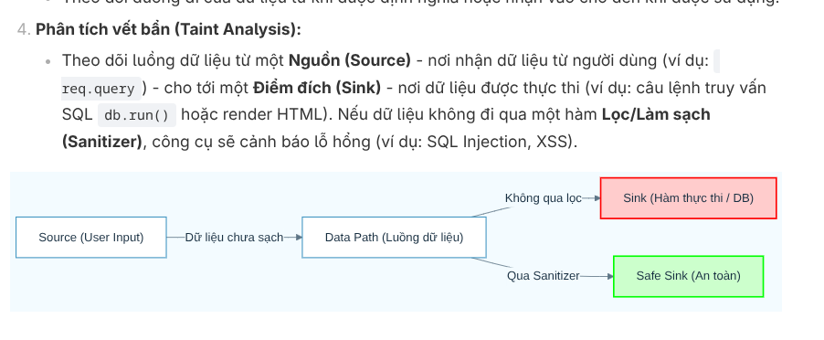
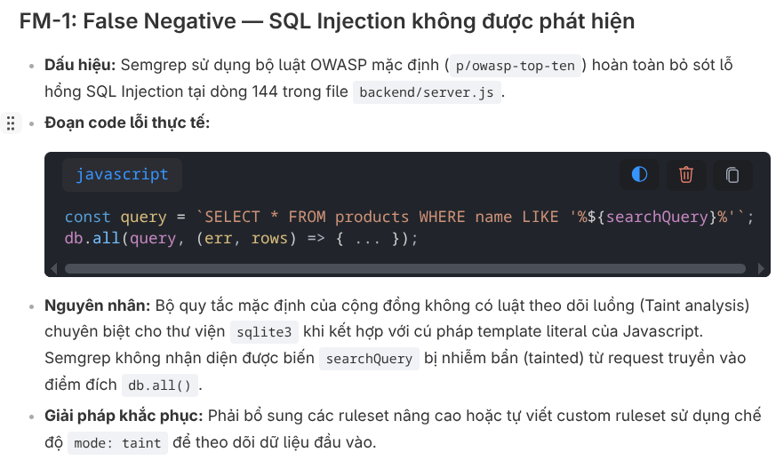
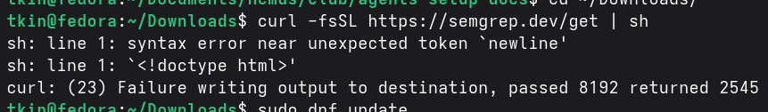

# Feedback

## 1. Track Semgrep

### 1.1. Giải thích hàm lọc



### 1.2. OWASP Top 10 có Injection

- A05:2025 - Injection
- Link: https://owasp.org/Top10/2025/A05_2025-Injection/
- Câu hỏi: Vậy Injection này khác gì mà không detect được?



### 1.3. Không tải theo hướng dẫn cho Linux

```terminal
tkin@fedora:~/Downloads$ curl -fsSL https://semgrep.dev/get | sh
sh: line 1: syntax error near unexpected token `newline'
sh: line 1: `<!doctype html>'
curl: (23) Failure writing output to destination, passed 8192 returned 2545
```



- Nên ghi cho Linux Distro nào
- Sử dụng pip thì được: ``pip install semgrep``

### 1.4. API Key script Semgrep

- Tạo .env.example chứa API Key
- Nên linh hoạt trong việc chọn model , nguồn cung cấp và API Key.
