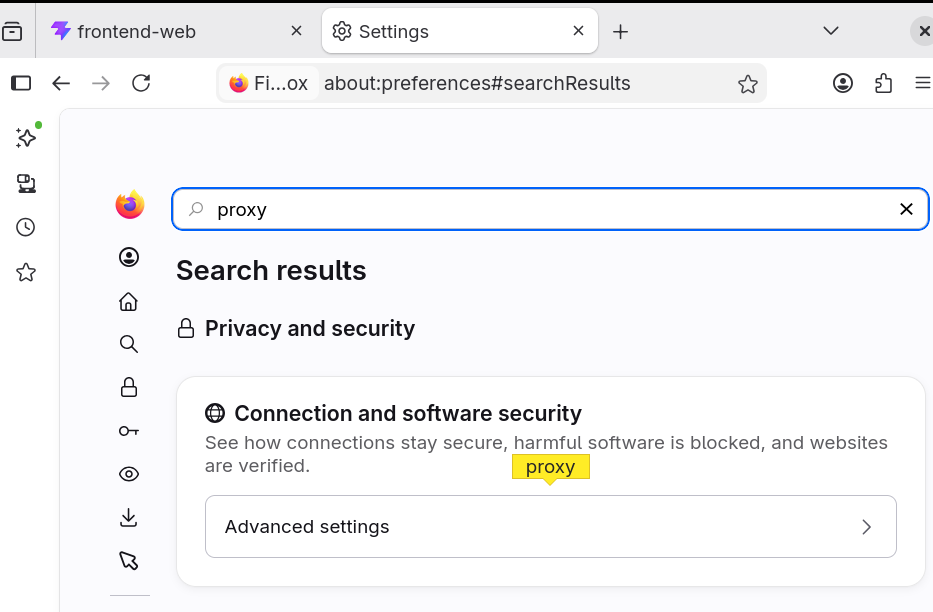
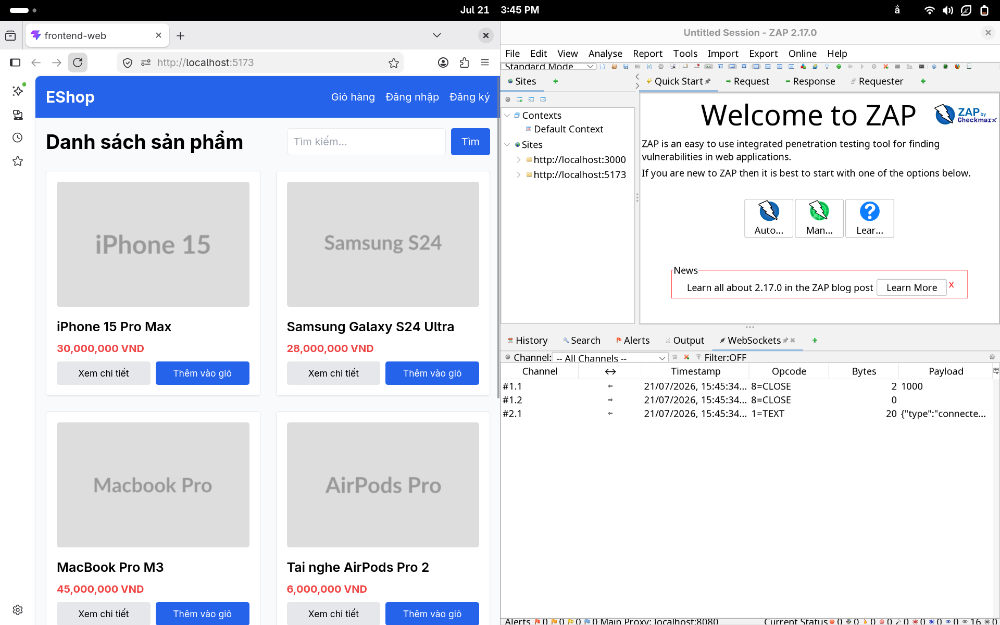
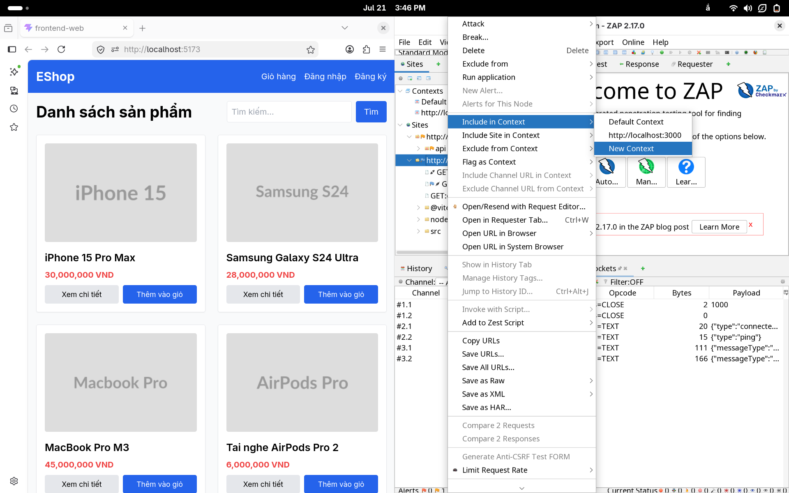
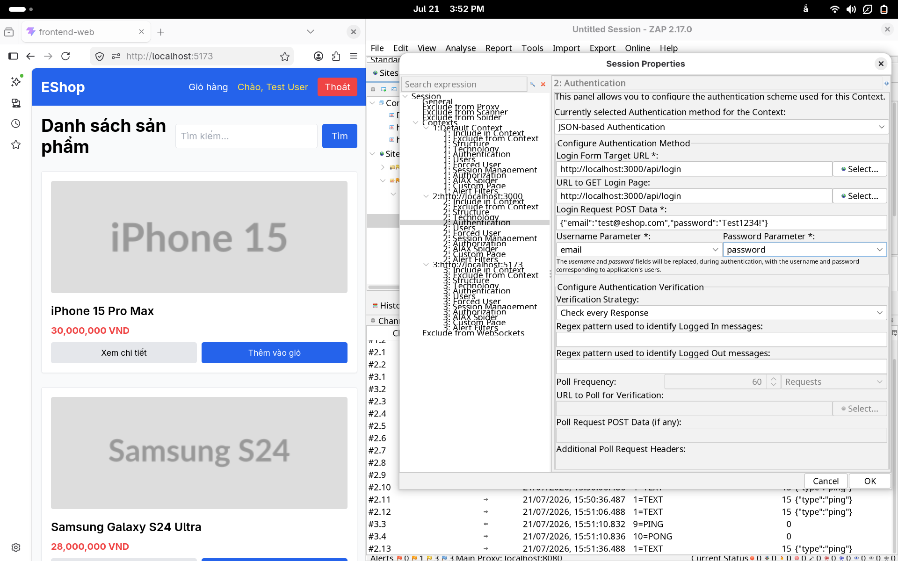
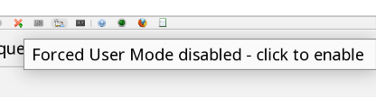

# Hướng dẫn ZAP GUI Scan cho EShop

Tài liệu này mô tả cách cấu hình OWASP ZAP bằng giao diện để quan sát traffic của EShop local, thiết lập authentication context và chạy spider/scan. Môi trường minh họa dùng frontend `http://localhost:5173`, backend `http://localhost:3000`, và ZAP proxy mặc định `localhost:8080`.

> Chỉ chạy active scan trên ứng dụng bạn có quyền kiểm thử. Với EShop lab, nên chạy frontend, backend và ZAP trên cùng máy để giảm lỗi proxy và xác thực.

## 1. Cấu hình Local Proxy

### Context

ZAP cần đứng giữa trình duyệt và EShop để ghi lại request/response. Sau bước này, mọi thao tác trên Firefox sẽ xuất hiện trong các tab `Sites`, `History`, `Request` và `Response` của ZAP.

### Step 1.1 - Mở Options của ZAP

Trong ZAP, chọn `Tools` -> `Options...`. Đây là nơi cấu hình proxy local, chứng chỉ, scanner và các tùy chọn runtime khác.

### Step 1.2 - Kiểm tra cổng proxy local

Trong `Network` -> `Local Servers/Proxies`, xác nhận main proxy đang lắng nghe trên `localhost:8080`. Nếu cổng này bị trùng, đổi sang cổng trống và dùng cùng cổng đó khi cấu hình Firefox.

### Step 1.3 - Mở cấu hình proxy của Firefox

Vào `Settings`, tìm `proxy`, rồi mở `Network Settings`. Chọn cấu hình proxy thủ công để trình duyệt gửi traffic HTTP/HTTPS qua ZAP.

### Step 1.4 - Trỏ HTTP proxy về ZAP

Nhập `localhost` cho host và `8080` cho port HTTP proxy. Với EShop local dùng HTTP, cấu hình này đủ để ZAP ghi nhận các request chính.

### Step 1.5 - Kiểm tra tùy chọn proxy localhost

Firefox có thể bỏ qua proxy cho địa chỉ local. Nếu traffic `localhost` không xuất hiện trong ZAP, mở `about:config` và tìm các tùy chọn proxy liên quan.

### Step 1.6 - Bật proxy cho localhost

Đặt `network.proxy.allow_hijacking_localhost` thành `true` để Firefox cho phép proxy traffic đến `localhost`. Sau đó mở `http://localhost:5173` và kiểm tra ZAP có ghi nhận domain trong tab `Sites`.

## 2. Thiết lập Authentication trong ZAP

### Context

Authenticated scan giúp ZAP truy cập các endpoint chỉ dành cho user đã đăng nhập. Với EShop, request login là JSON API gửi đến backend `http://localhost:3000/api/login`, trong khi thao tác người dùng bắt đầu từ frontend `http://localhost:5173`.

### 2.1. Include context

#### Step 2.1.1 - Duyệt EShop qua proxy

Mở EShop trong Firefox đã cấu hình proxy. Khi trang sản phẩm hiển thị, ZAP sẽ ghi nhận `http://localhost:5173` và các request đến backend `http://localhost:3000`.

#### Step 2.1.2 - Tạo context cho URL liên quan

Trong cây `Sites`, chọn host cần kiểm thử rồi thêm vào context. Context giúp ZAP biết phạm vi nào thuộc EShop và tránh quét nhầm dịch vụ không liên quan.

#### Step 2.1.3 - Bao gồm frontend và backend

Đảm bảo cả frontend `localhost:5173` và backend `localhost:3000` đều nằm trong context. Frontend cung cấp luồng tương tác, còn backend chứa API cần kiểm thử.

#### Step 2.1.4 - Tạo traffic đăng nhập/đăng ký

Thực hiện đăng nhập hoặc đăng ký trên EShop để ZAP ghi lại request authentication. Kết quả mong đợi là `Sites` có các endpoint như `/api/login`, `/api/users/me`, và các request phát sinh từ frontend.

### 2.2. Setup account

#### Step 2.2.1 - Đánh dấu request login

Chọn request `POST /api/login`, mở menu chuột phải và chọn `Flag as Context` -> context tương ứng -> `JSON-based Auth Login Request`. Bước này cho ZAP biết request nào dùng để lấy phiên đăng nhập.

#### Step 2.2.2 - Cấu hình authentication method

Trong phần `Authentication`, kiểm tra URL login, method và payload JSON.

#### Step 2.2.3 - Tạo user test trong context

Mở tab `Users` của context và tạo tài khoản test. Dùng tài khoản riêng cho lab vì ZAP có thể tạo nhiều request và làm thay đổi dữ liệu trong quá trình scan.

#### Step 2.2.4 - Nhập credential cho user

Nhập username/password khớp với tài khoản EShop. Sau khi lưu, có thể dùng chức năng verify/session test của ZAP để kiểm tra ZAP đăng nhập thành công.

#### Step 2.2.5 - Bật forced-user mode

Bật `Forced User Mode` để ZAP tự động gắn user đã cấu hình vào các request trong context. Bước này quan trọng khi spider hoặc active scan các chức năng yêu cầu đăng nhập.

## 3. Chạy Spider/Scan

### Context

Sau khi context và user đã sẵn sàng, dùng spider để khám phá endpoint trước. Nếu ứng dụng dùng nhiều JavaScript route, chạy thêm AJAX Spider. Chỉ chuyển sang Active Scan khi đã xác nhận scope đúng và số URL trong `Sites` không quá lớn. Với frontend SPA, nếu AJAX Spider tạo hàng trăm hoặc hàng nghìn URL, nên dừng ở passive scan rồi active scan backend/API riêng để tránh quá tải RAM.

Trong cây `Contexts` hoặc `Sites`, chọn host/context cần quét, mở menu chuột phải và chọn `Spider...`. Với frontend SPA, có thể chọn `AJAX Spider...` để ZAP điều khiển trình duyệt và khám phá route động.

Khi chạy bằng CLI, dùng thêm `--max-urls 300` cho frontend user/admin. Nếu số URL đã crawl vượt giới hạn này, script sẽ bỏ qua Active Scan và vẫn xuất report passive/crawl để làm evidence.
