# Project Contribution Template

Source template: `resources/2022-2023-HK2-GroupXX-Project Contribution.xlsx`

## Summary

| Field  | Value |
| ------ | ----- |
| Course |       |
| Class  |       |
| Group  |       |

## Project Metrics

| Metric                                    | Value | Note                                   |
| ----------------------------------------- | ----: | -------------------------------------- |
| Number of students working in the project |     5 | Input                                  |
| Number of tasks                           |    50 | Calculated from student task counts    |
| Number of task hours                      |   300 | Calculated from student task hours     |
| Number of Git commits                     |   100 | Calculated from student Git commits    |
| Max student percentage                    |   24% | Calculated from Percent column         |
| Project score                             | 8.225 | Entered by TA or estimated by students |

## Instructions

> Do not edit the grey cells. TAs will enter the score of all PAs in the project score and get the individual scores. Students can enter an estimated project score to see how percentages affects your scores.

> Use columns Tasks - Percent, Task Hours - Percent, Git - Percent as references for column Percent.

## Student Contribution Summary

| No | Student ID | Full name | Tasks | Tasks - Percent | Task Hours | Task Hours - Percent | Git Commits | Git - Percent | Percent | Score - Student | Score - TA |
| -- | ---------- | --------- | ----- | --------------- | ---------- | -------------------- | ----------- | ------------- | ------- | --------------- | ---------- |
| 1  |            |           | 10    | 20%             | 60         | 20%                  | 20          | 20%           | 23%     | 8.0             |            |
| 2  |            |           | 10    | 20%             | 60         | 20%                  | 20          | 20%           | 23%     | 8.0             |            |
| 3  |            |           | 10    | 20%             | 60         | 20%                  | 20          | 20%           | 23%     | 8.0             |            |
| 4  |            |           | 10    | 20%             | 60         | 20%                  | 20          | 25%           | 24%     | 8.225           |            |
| 5  |            |           | 10    | 20%             | 60         | 20%                  | 20          | 25%           | 7%      | 2.5             |            |

## Original Formula Reference

| Cell / Column        | Formula or rule                                                                         |
| -------------------- | --------------------------------------------------------------------------------------- |
| D7                   | `SUM(D17:D25)`                                                                        |
| D8                   | `SUM(F17:F25)`                                                                        |
| D9                   | `SUM(H17:H25)`                                                                        |
| D10                  | `MAX(J17:J25)`                                                                        |
| Tasks - Percent      | `IF($D$7=0, 0, Tasks / $D$7)`                                                         |
| Task Hours - Percent | `IF($D$8=0, 0, Task Hours / $D$8)`                                                    |
| Git - Percent        | `IF($D$9=0, 0, Git Commits / $D$9)`                                                   |
| Score - Student      | `IF(Percent=$D$10, $D$11, ROUND(2 * ($D$11 - $D$11 * (1 - Percent / $D$10)), 0) / 2)` |

## Tasks

A task should be done by only 1-2 students. Duplicate tasks are not recommended. Each member should work on at least 5 tasks.

| No  | Student ID | Full name           | Task Description                                                                                                                      | Hours | Evidence                                                                                                                                                                |
| --- | ---------- | ------------------- | ------------------------------------------------------------------------------------------------------------------------------------- | ----- | ----------------------------------------------------------------------------------------------------------------------------------------------------------------------- |
| 1   | 23127075   | Lê Trung Kiên     | Tìm hiểu về DAST và ghi vào user guide.                                                                                          | 0.5   | 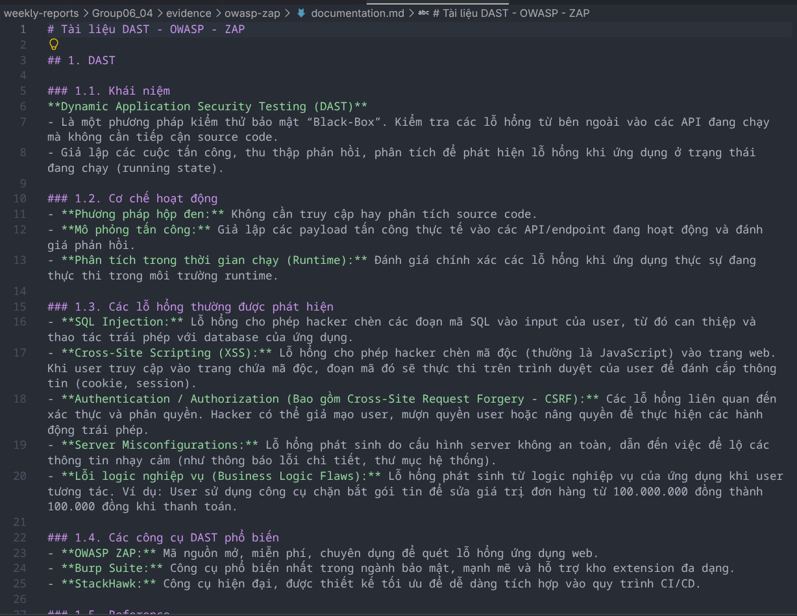                                                                                                                                   |
| 2   | 23127075   | Lê Trung Kiên     | Tìm hiểu về ZAP và ghi vào user guide.                                                                                           | 3     | 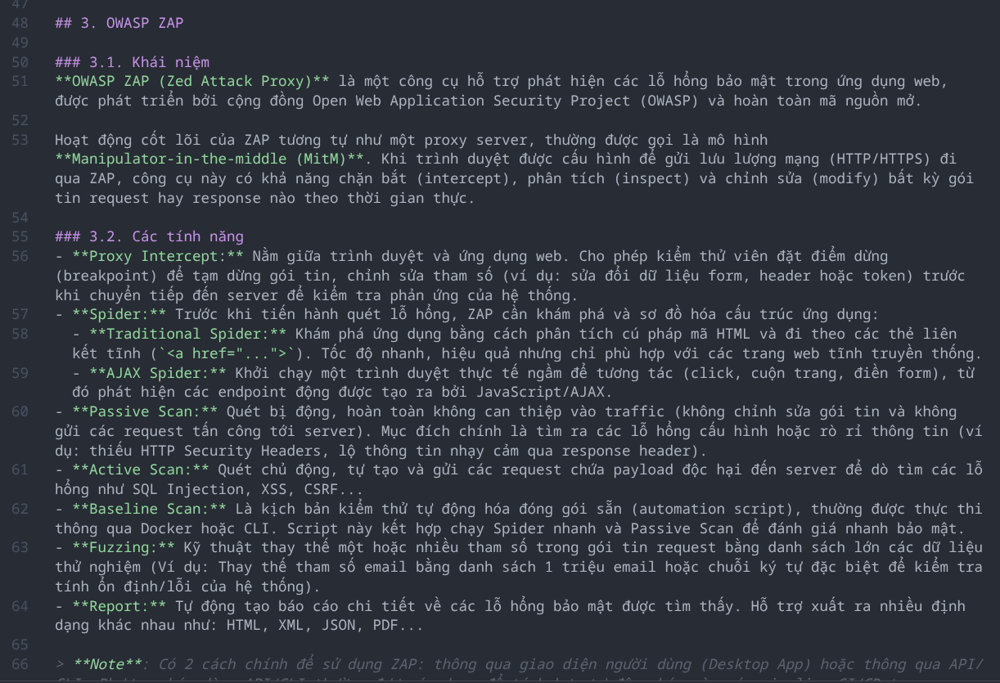                                                                                                                                   |
| 3   | 23127075   | Lê Trung Kiên     | Tìm hiểu về OWASP Top 10: 1, 2 và ghi vào user guide.                                                                            | 1     | 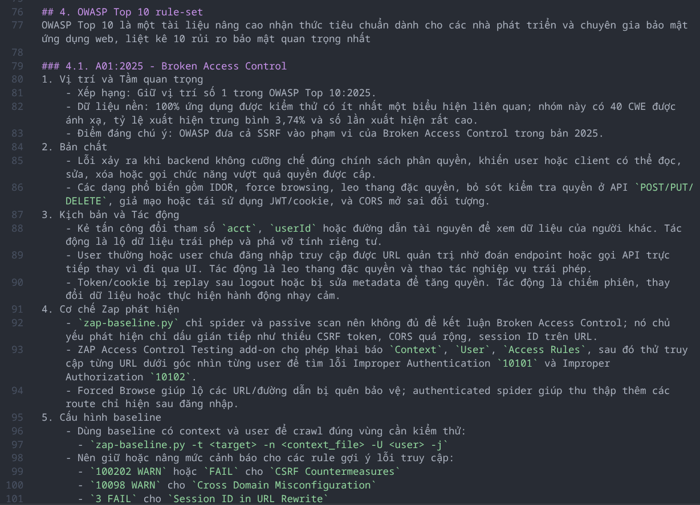                                                                                                                                   |
| 4   | 23127075   | Lê Trung Kiên     | Cài đặt và chạy cơ bản ZAP và ghi vào user guide.                                                                            | 5     |                                                                                                                                    |
| 5   | 23127075   | Lê Trung Kiên     | Cấu hình output format của ZAP scan.                                                                                               | 5     |                                                                                                                                    |
| 6   | 23127075   | Lê Trung Kiên     | Tạo Activity Worksheet                                                                                                               | 1     | 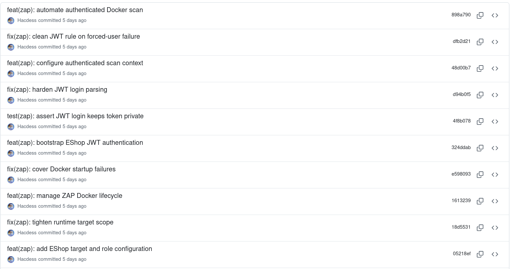                                                                                                                                   |
| 7   | 23127075   | Lê Trung Kiên     | Cấu hình authenticated ZAP scan với ZAP GUI.                                                                                       | 8     |                                                                                                                                    |
| 8   | 23127075   | Lê Trung Kiên     | Viết script tạo AI Triage cho ZAP scan.                                                                                             | 5     | 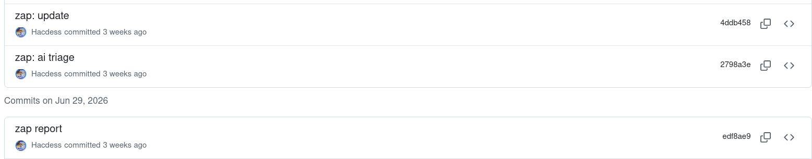                                                                                         |
| 9   | 23127075   | Lê Trung Kiên     | Viết script tạo testcase cho ZAP scan.                                                                                              | 5     |                                                                                                                                    |
| 10  | 23127075   | Lê Trung Kiên     | Viết outline thuyết trình và slide.                                                                                               | 1     |                                                                                                                                    |
| 11  | 23127075   | Lê Trung Kiên     | Khởi tạo slide thuyết trình cho nhóm (sườn và nội dung được giao).                                                        | 3     |                                                                                                                                    |
| 12  |            |                     |                                                                                                                                       |       |                                                                                                                                                                         |
| 13  |            |                     |                                                                                                                                       |       |                                                                                                                                                                         |
| 14  |            |                     |                                                                                                                                       |       |                                                                                                                                                                         |
| 15  |            |                     |                                                                                                                                       |       |                                                                                                                                                                         |
| 16  |            |                     |                                                                                                                                       |       |                                                                                                                                                                         |
| 17  |            |                     |                                                                                                                                       |       |                                                                                                                                                                         |
| 18  |            |                     |                                                                                                                                       |       |                                                                                                                                                                         |
| 19  |            |                     |                                                                                                                                       |       |                                                                                                                                                                         |
| 20  |            |                     |                                                                                                                                       |       |                                                                                                                                                                         |
| 21  |            |                     |                                                                                                                                       |       |                                                                                                                                                                         |
| 22  |            |                     |                                                                                                                                       |       |                                                                                                                                                                         |
| 23  |            |                     |                                                                                                                                       |       |                                                                                                                                                                         |
| 24  |            |                     |                                                                                                                                       |       |                                                                                                                                                                         |
| 25  |            |                     |                                                                                                                                       |       |                                                                                                                                                                         |
| 26  |            |                     |                                                                                                                                       |       |                                                                                                                                                                         |
| 27  |            |                     |                                                                                                                                       |       |                                                                                                                                                                         |
| 28  |            |                     |                                                                                                                                       |       |                                                                                                                                                                         |
| 29  |            |                     |                                                                                                                                       |       |                                                                                                                                                                         |
| 30  |            |                     |                                                                                                                                       |       |                                                                                                                                                                         |
| 31  |            |                     |                                                                                                                                       |       |                                                                                                                                                                         |
| 32  |            |                     |                                                                                                                                       |       |                                                                                                                                                                         |
| 33  |            |                     |                                                                                                                                       |       |                                                                                                                                                                         |
| 34  |            |                     |                                                                                                                                       |       |                                                                                                                                                                         |
| 35  |            |                     |                                                                                                                                       |       |                                                                                                                                                                         |
| 36  |            |                     |                                                                                                                                       |       |                                                                                                                                                                         |
| 37  |            |                     |                                                                                                                                       |       |                                                                                                                                                                         |
| 38  |            |                     |                                                                                                                                       |       |                                                                                                                                                                         |
| 39  |            |                     |                                                                                                                                       |       |                                                                                                                                                                         |
| 40  | 23127185   | Mai Thị Kim Duyên | Tìm hiểu về ZAP.                                                                                                                   |       | 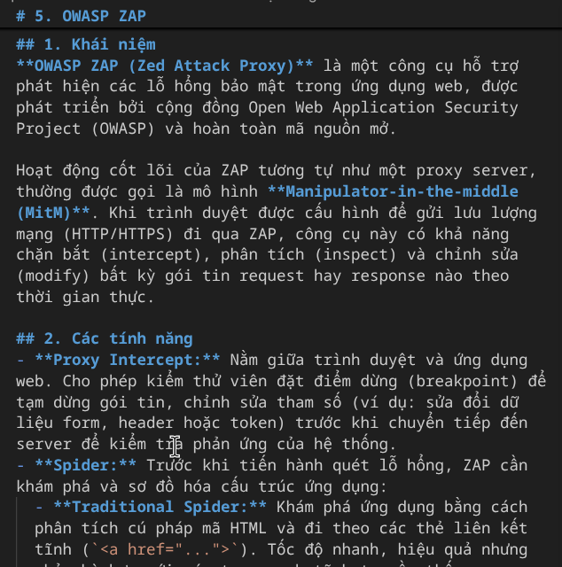                                                                                                                              |
| 41  | 23127185   | Mai Thị Kim Duyên | Tìm hiểu về OWASP.                                                                                                                 |       | 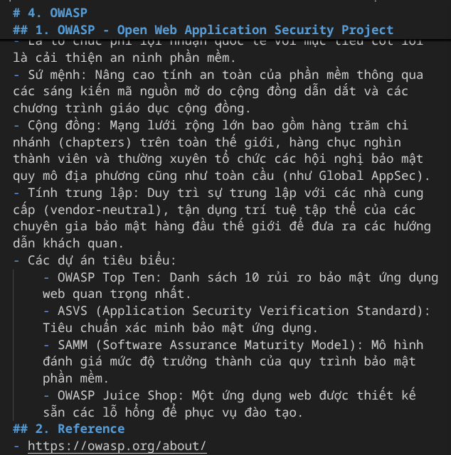                                                                                                                            |
| 42  | 23127185   | Mai Thị Kim Duyên | Tìm hiểu về OWASP Top 10: 3; 4.                                                                                                    |       | 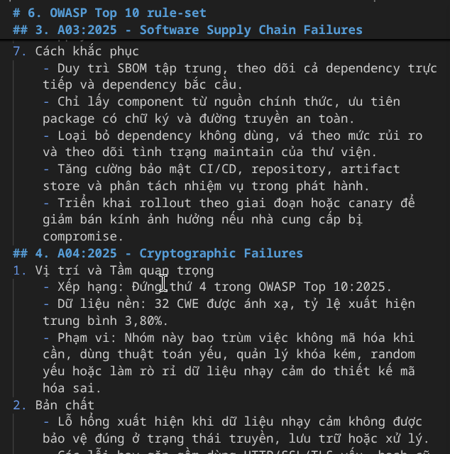                                                                                                                          |
| 43  | 23127185   | Mai Thị Kim Duyên | Track Zap: Cài đặt và chạy Zap                                                                                                   |       |                                                                                                                               |
| 44  | 23127185   | Mai Thị Kim Duyên | Track Zap: Tạo flow Test với Zap, AI Triage (có báo cáo output)                                                                  |       |                                                                                                                          |
| 45  | 23127185   | Mai Thị Kim Duyên | Cài đặt và chạy cơ bản Semgrep theo hướng dẫn đã viết                                                                   |       | 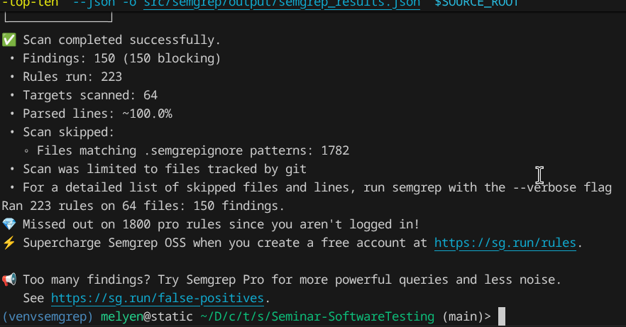                                                                                                                               |
| 46  | 23127185   | Mai Thị Kim Duyên | Hoàn thiện Track Zap trên EShop, bổ sung evidence, output scan, AI triage và ghi chú kiểm chứng.                              |       |                                                                                                                       |
| 47  | 23127185   | Mai Thị Kim Duyên | Chuẩn bị slide và user guide cho OWASP Top 10 mục 3, 4 và 5, kèm phần giới thiệu ngắn.                                      |       |                                                                                                                                   |
| 48  | 23127185   | Mai Thị Kim Duyên | Viết slide và user guide giới thiệu script ZAP của nhóm, gồm cách dùng các flag chính và ý nghĩa output.                |       |                                                                                                                                       |
| 49  | 23127185   | Mai Thị Kim Duyên | Phối hợp quay video demo workflow.                                                                                                  |       | 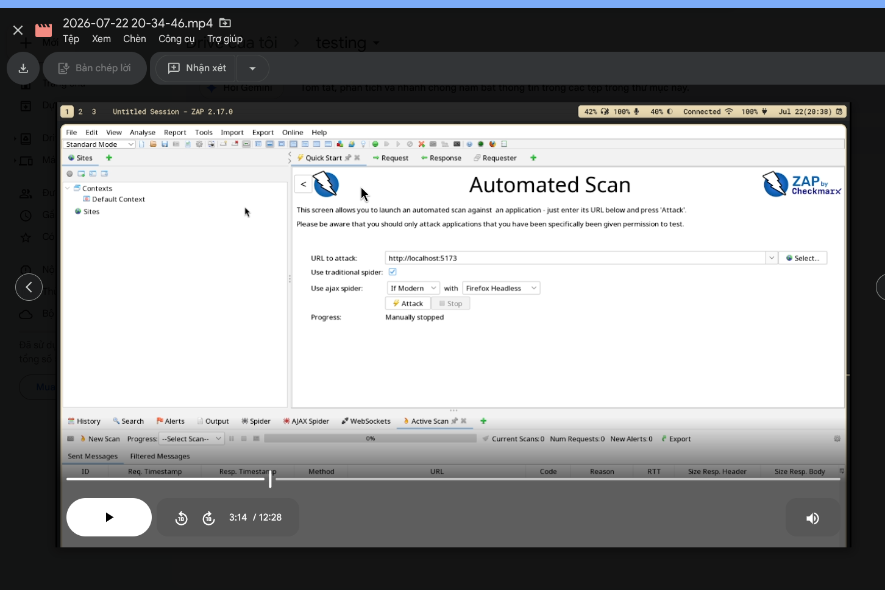                                                                                                                                 |
| 50  |            |                     |                                                                                                                                       |       |                                                                                                                                                                         |
| 51  |            |                     |                                                                                                                                       |       |                                                                                                                                                                         |
| 52  |            |                     |                                                                                                                                       |       |                                                                                                                                                                         |
| 53  |            |                     |                                                                                                                                       |       |                                                                                                                                                                         |
| 54  |            |                     |                                                                                                                                       |       |                                                                                                                                                                         |
| 55  |            |                     |                                                                                                                                       |       |                                                                                                                                                                         |
| 56  |            |                     |                                                                                                                                       |       |                                                                                                                                                                         |
| 57  |            |                     |                                                                                                                                       |       |                                                                                                                                                                         |
| 58  |            |                     |                                                                                                                                       |       |                                                                                                                                                                         |
| 59  |            |                     |                                                                                                                                       |       |                                                                                                                                                                         |
| 60  |            |                     |                                                                                                                                       |       |                                                                                                                                                                         |
| 61  |            | Lê Mai Hoài Bảo  | Initial survey of Semgrep, OWASP ZAP, Burp Suite, and Gemini API tools to propose direction for the security testing seminar.                                                                      | 1     | 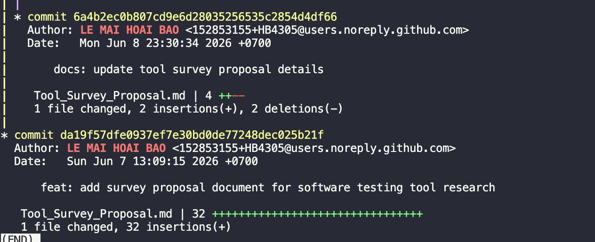 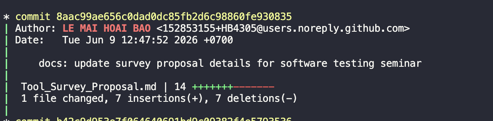                                                                                                                      |
| 62  |            | Lê Mai Hoài Bảo  | Construct security testing workflow documentation combining Semgrep SAST, ZAP DAST, and AI triage.                                                                                                 | 2     | 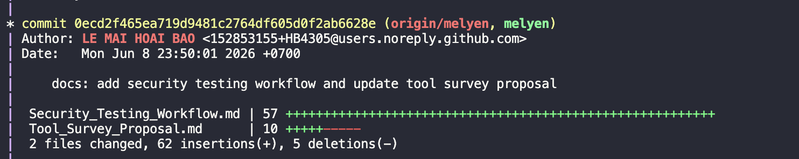                                                                                                                                                                    |
| 63  |            | Lê Mai Hoài Bảo  | Research and summarize the Semgrep/SAST track for the seminar; research OWASP Top 10 categories 7, 8, 9, and 10.                                                                                   | 1     | 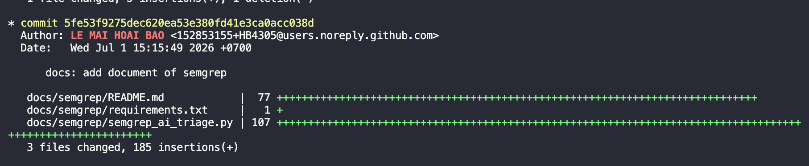                                                                                                                               |
| 64  |            | Lê Mai Hoài Bảo  | Create Track A Semgrep template, add image/resource evidence, and complete phase 1 content for Track A in the report template.                                                                      | 0.5     | 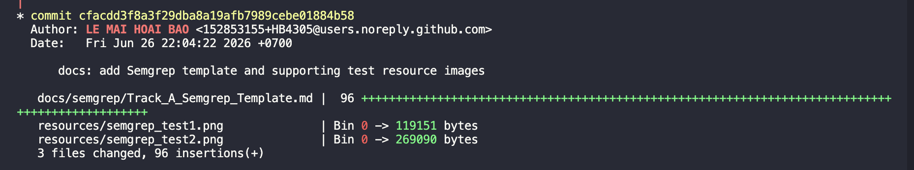 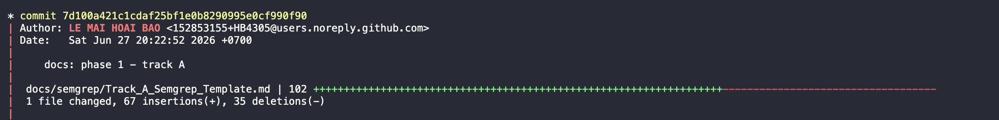                                                                                                                              |
| 65  |            | Lê Mai Hoài Bảo  | Install, test run Semgrep, and document scan/output instructions for the EShop project.                                                                                                             | 1     | 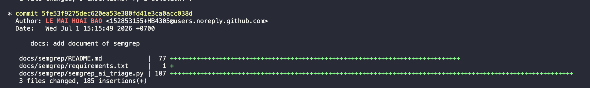                                                                                                                                                                    |
| 66  |            | Lê Mai Hoài Bảo  | Build Semgrep AI Triage flow and sample report for `hardcoded-jwt-secret` finding.                                                                                                                  | 1     | 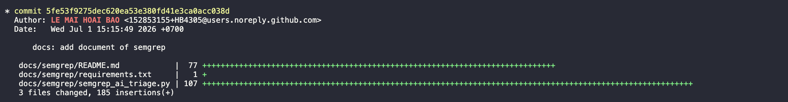                                                                                                                       |
| 67  |            | Lê Mai Hoài Bảo  | Fix Gemini integration for `semgrep_ai_triage.py`, migrate to new SDK, and handle error/retry on API overload.                                                                                      | 0.5     | 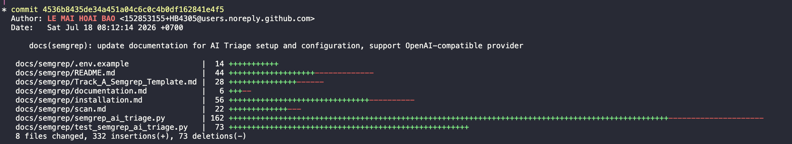 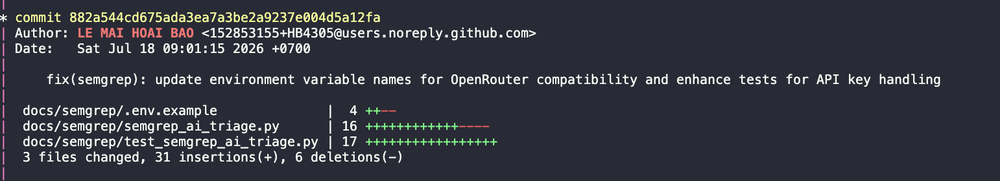 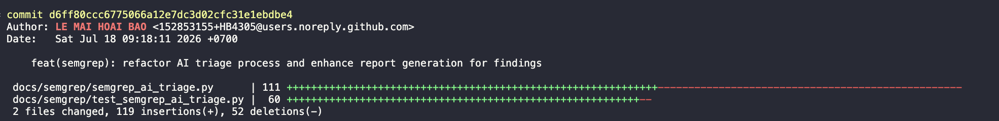 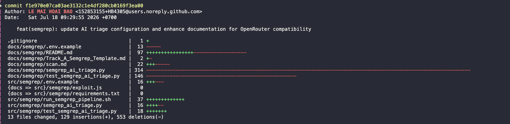                                  |
| 68  |            | Lê Mai Hoài Bảo  | Update Semgrep AI Triage documentation to support OpenRouter/OpenAI-compatible provider and add `.env.example` configuration for OpenRouter/Gemini with standardized API key/base URL variables.    | 1     |   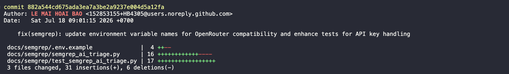 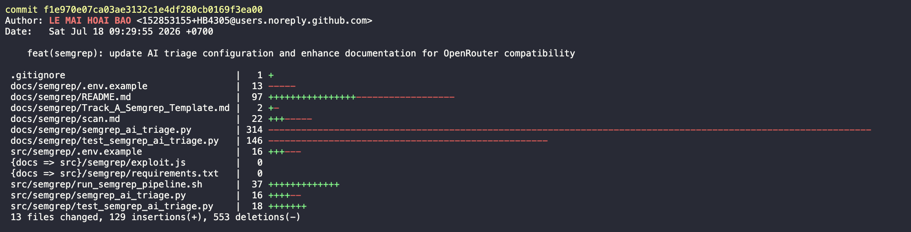                                      |
| 69  |            | Lê Mai Hoài Bảo  | Upgrade Semgrep AI triage script to process all findings in JSON instead of a single finding.                                                                                                       | 0.5     | 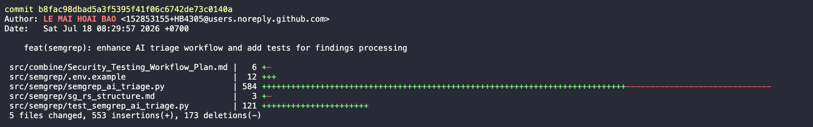                                                                                                                       |
| 70  |            | Lê Mai Hoài Bảo  | Write unit tests for OpenRouter configuration and multi-finding processing; retest offline triage workflow confirming all 12 findings are handled without live API dependency.                       | 0.5     |    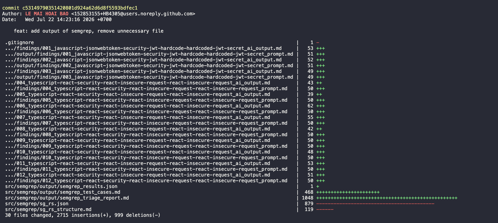                                      |
| 71  |            | Lê Mai Hoài Bảo  | Reorganize Semgrep Track structure: docs in `docs/semgrep/`, scripts/runtime in `src/semgrep/`, pipeline runnable from root.                                                                        | 0.5     | 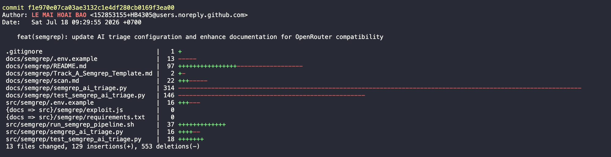                                                                                                                                                                    |
| 72  |            | Lê Mai Hoài Bảo  | Update Semgrep section in User Guide (EShop source path, scanning methods, `.semgrepignore`, custom rules, root execution guide) and fix Semgrep Linux installation guide in Track A documentation. | 1     | 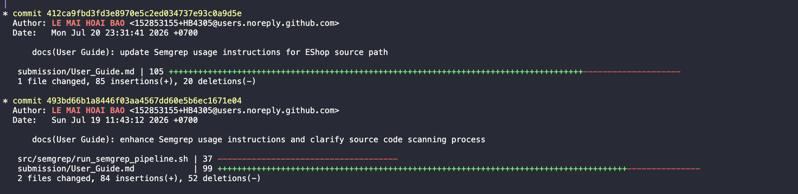 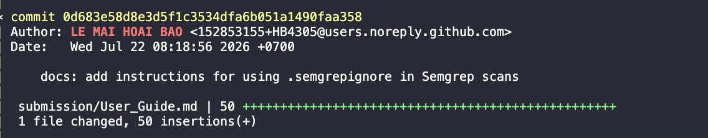 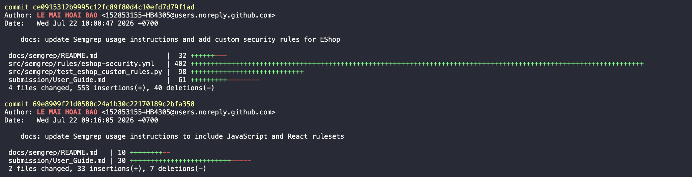 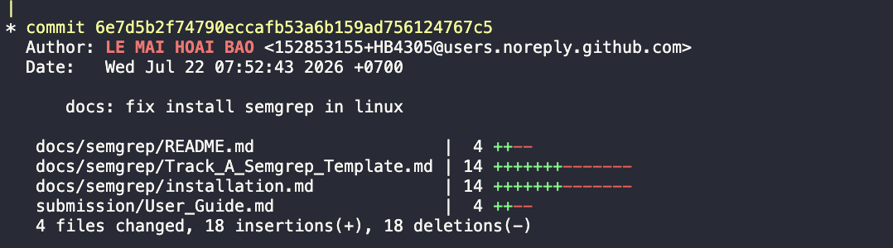                                      |
| 73  |            | Lê Mai Hoài Bảo  | Create project contribution template and final documentation checklist for group submission tracking; review and complete AI audit/disclosure/reflective statement for the group.                    | 0.5     | 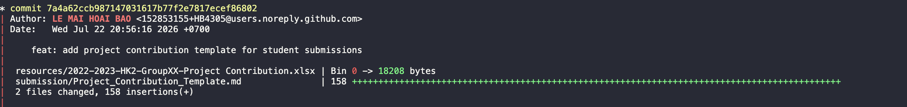 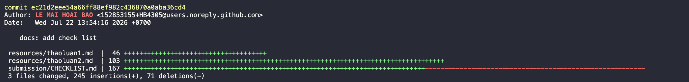 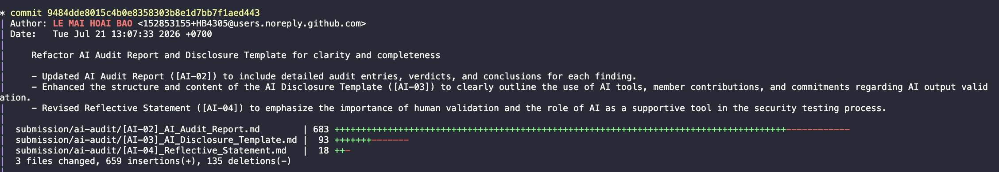 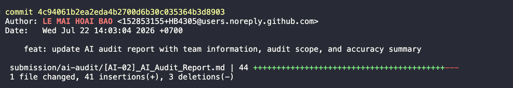 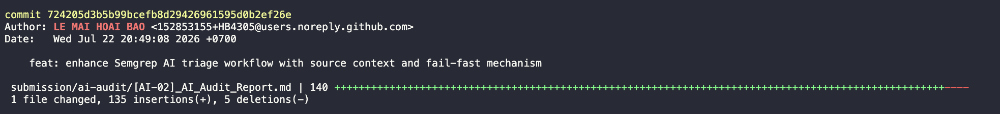 |
| 74  |            |                     |                                                                                                                                                                                                     |       |                                                                                                                                                                                                          |
| 75  |            |                     |                                                                                                                                                                                                     |       |                                                                                                                                                                                                          |
| 76  |            |                     |                                                                                                                                                                                                     |       |                                                                                                                                                                                                          |
| 77  |            |                     |                                                                                                                                                                                                     |       |                                                                                                                                                                                                          |
| 78  |            |                     |                                                                                                                                                                                                     |       |                                                                                                                                                                                                          |
| 79  |            |                     |                                                                                                                                                                                                     |       |                                                                                                                                                                                                          |
| 80  |            |                     |                                                                                                                                                                                                     |       |                                                                                                                                                                                                          |
| 81  |            |                     |                                                                                                                                       |       |                                                                                                                                                                         |
| 82  |            |                     |                                                                                                                                       |       |                                                                                                                                                                         |
| 83  |            |                     |                                                                                                                                       |       |                                                                                                                                                                         |
| 84  |            |                     |                                                                                                                                       |       |                                                                                                                                                                         |
| 85  |            |                     |                                                                                                                                       |       |                                                                                                                                                                         |
| 86  |            |                     |                                                                                                                                       |       |                                                                                                                                                                         |
| 87  |            |                     |                                                                                                                                       |       |                                                                                                                                                                         |
| 88  |            |                     |                                                                                                                                       |       |                                                                                                                                                                         |
| 89  |            |                     |                                                                                                                                       |       |                                                                                                                                                                         |
| 90  |            |                     |                                                                                                                                       |       |                                                                                                                                                                         |
| 91  |            |                     |                                                                                                                                       |       |                                                                                                                                                                         |
| 92  |            |                     |                                                                                                                                       |       |                                                                                                                                                                         |
| 93  |            |                     |                                                                                                                                       |       |                                                                                                                                                                         |
| 94  |            |                     |                                                                                                                                       |       |                                                                                                                                                                         |
| 95  |            |                     |                                                                                                                                       |       |                                                                                                                                                                         |
| 96  |            |                     |                                                                                                                                       |       |                                                                                                                                                                         |
| 97  |            |                     |                                                                                                                                       |       |                                                                                                                                                                         |
| 98  |            |                     |                                                                                                                                       |       |                                                                                                                                                                         |
| 99  |            |                     |                                                                                                                                       |       |                                                                                                                                                                         |
| 100 |            |                     |                                                                                                                                       |       |                                                                                                                                                                         |
