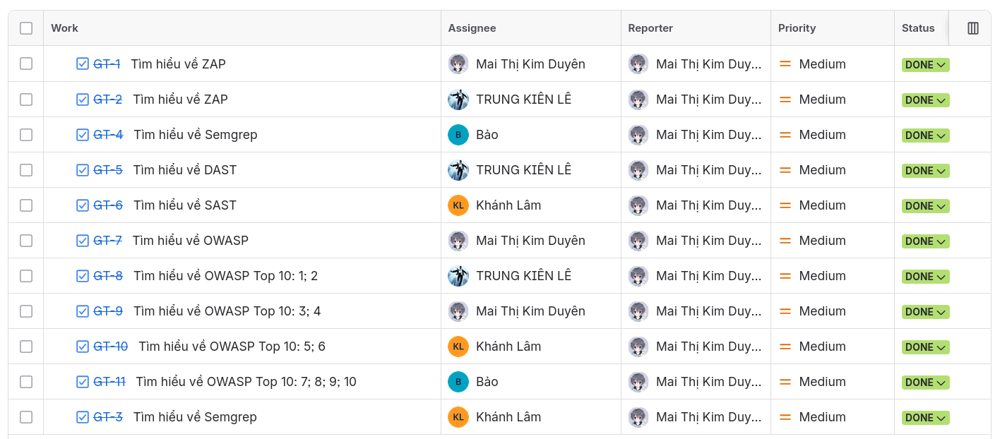
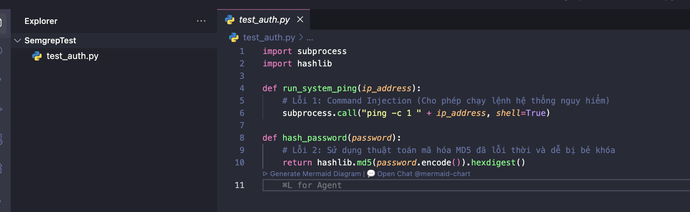
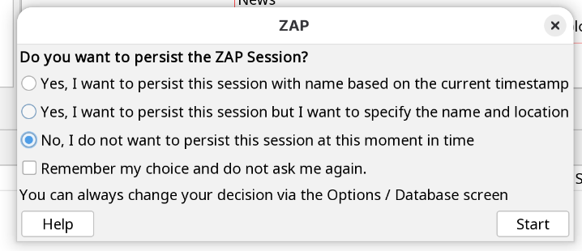
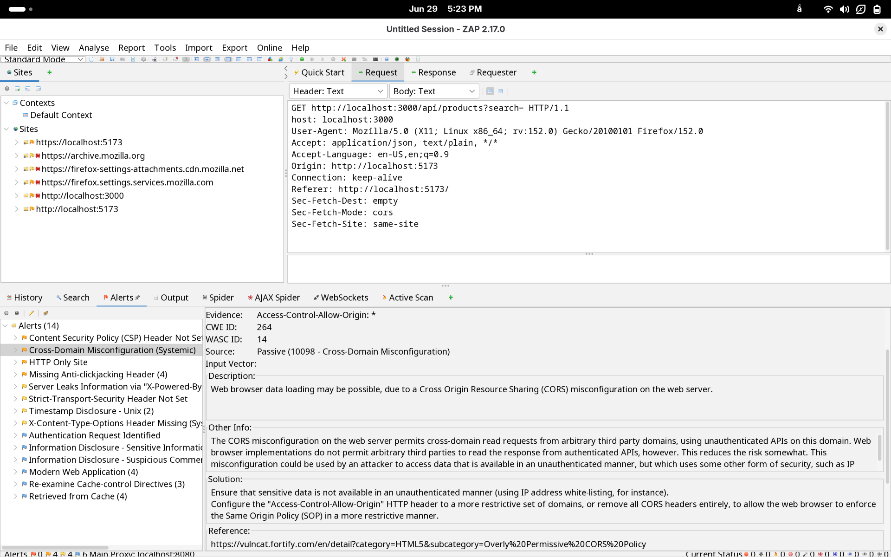
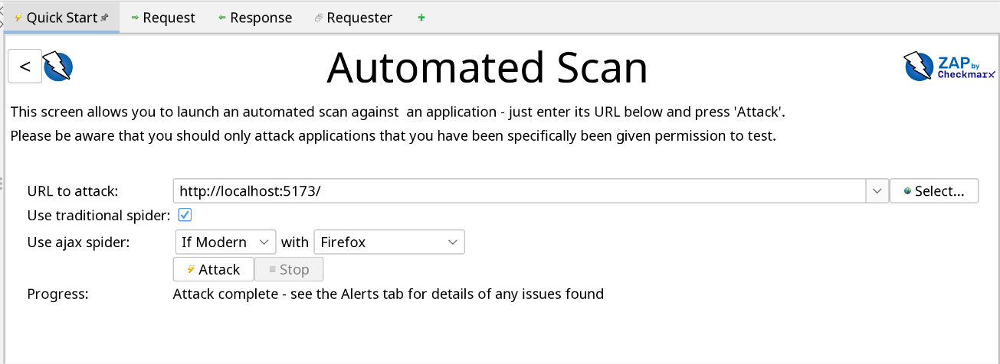
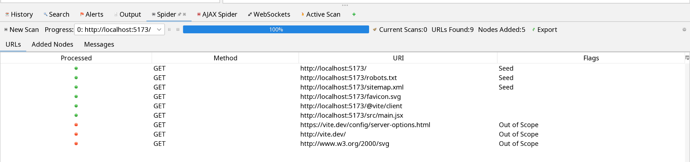
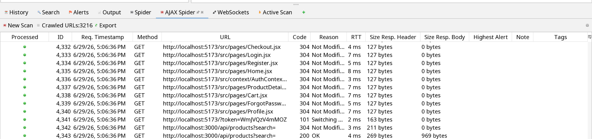

# Project Contribution Template

Source template: `resources/2022-2023-HK2-GroupXX-Project Contribution.xlsx`

## Summary

| Field | Value |
|---|---|
| Course |  |
| Class |  |
| Group |  |

## Project Metrics

| Metric | Value | Note |
|---|---:|---|
| Number of students working in the project | 5 | Input |
| Number of tasks | 50 | Calculated from student task counts |
| Number of task hours | 300 | Calculated from student task hours |
| Number of Git commits | 100 | Calculated from student Git commits |
| Max student percentage | 24% | Calculated from Percent column |
| Project score | 8.225 | Entered by TA or estimated by students |

## Instructions

> Do not edit the grey cells. TAs will enter the score of all PAs in the project score and get the individual scores. Students can enter an estimated project score to see how percentages affects your scores.

> Use columns Tasks - Percent, Task Hours - Percent, Git - Percent as references for column Percent.

## Student Contribution Summary

| No | Student ID | Full name | Tasks | Tasks - Percent | Task Hours | Task Hours - Percent | Git Commits | Git - Percent | Percent | Score - Student | Score - TA |
|---|---|---|---|---|---|---|---|---|---|---|---|
| 1 |  |  | 10 | 20% | 60 | 20% | 20 | 20% | 23% | 8.0 |  |
| 2 |  |  | 10 | 20% | 60 | 20% | 20 | 20% | 23% | 8.0 |  |
| 3 |  |  | 10 | 20% | 60 | 20% | 20 | 20% | 23% | 8.0 |  |
| 4 |  |  | 10 | 20% | 60 | 20% | 20 | 25% | 24% | 8.225 |  |
| 5 |  |  | 10 | 20% | 60 | 20% | 20 | 25% | 7% | 2.5 |  |

## Original Formula Reference

| Cell / Column | Formula or rule |
|---|---|
| D7 | `SUM(D17:D25)` |
| D8 | `SUM(F17:F25)` |
| D9 | `SUM(H17:H25)` |
| D10 | `MAX(J17:J25)` |
| Tasks - Percent | `IF($D$7=0, 0, Tasks / $D$7)` |
| Task Hours - Percent | `IF($D$8=0, 0, Task Hours / $D$8)` |
| Git - Percent | `IF($D$9=0, 0, Git Commits / $D$9)` |
| Score - Student | `IF(Percent=$D$10, $D$11, ROUND(2 * ($D$11 - $D$11 * (1 - Percent / $D$10)), 0) / 2)` |

## Tasks

A task should be done by only 1-2 students. Duplicate tasks are not recommended. Each member should work on at least 5 tasks.

| No | Student ID | Full name | Task Description | Hours | Evidence (screenshots of chat messages, of Git commits... proving that you perform and finish the task) |
|---|---|---|---|---|---|
| 1 |  |  |  |  |  |
| 2 |  |  |  |  |  |
| 3 |  |  |  |  |  |
| 4 |  |  |  |  |  |
| 5 |  |  |  |  |  |
| 6 |  |  |  |  |  |
| 7 |  |  |  |  |  |
| 8 |  |  |  |  |  |
| 9 |  |  |  |  |  |
| 10 |  |  |  |  |  |
| 11 |  |  |  |  |  |
| 12 |  |  |  |  |  |
| 13 |  |  |  |  |  |
| 14 |  |  |  |  |  |
| 15 |  |  |  |  |  |
| 16 |  |  |  |  |  |
| 17 |  |  |  |  |  |
| 18 |  |  |  |  |  |
| 19 |  |  |  |  |  |
| 20 |  |  |  |  |  |
| 21 |  |  |  |  |  |
| 22 |  |  |  |  |  |
| 23 |  |  |  |  |  |
| 24 |  |  |  |  |  |
| 25 |  |  |  |  |  |
| 26 |  |  |  |  |  |
| 27 |  |  |  |  |  |
| 28 |  |  |  |  |  |
| 29 |  |  |  |  |  |
| 30 |  |  |  |  |  |
| 31 |  |  |  |  |  |
| 32 |  |  |  |  |  |
| 33 |  |  |  |  |  |
| 34 |  |  |  |  |  |
| 35 |  |  |  |  |  |
| 36 |  |  |  |  |  |
| 37 |  |  |  |  |  |
| 38 |  |  |  |  |  |
| 39 |  |  |  |  |  |
| 40 | 23127185 | Mai Thị Kim Duyên | Tìm hiểu về ZAP.   |  |  |
| 41 | 23127185 | Mai Thị Kim Duyên | Tìm hiểu về OWASP. |  | |
| 42 | 23127185 | Mai Thị Kim Duyên | Tìm hiểu về OWASP Top 10: 3; 4. |  |  |
| 43 | 23127185  | Mai Thị Kim Duyên  | Track Zap: Cài đặt và chạy Zap |  |   |
| 44 | 23127185 | Mai Thị Kim Duyên |  Track Zap: Tạo flow Test với Zap, AI Triage (có báo cáo output) |  |  |
| 45 | 23127185 | Mai Thị Kim Duyên | Cài đặt và chạy cơ bản Semgrep theo hướng dẫn đã viết |  |  |
| 46 | 23127185 | Mai Thị Kim Duyên | Hoàn thiện Track Zap trên EShop, bổ sung evidence, output scan, AI triage và ghi chú kiểm chứng. |  |  |
| 47 | 23127185 | Mai Thị Kim Duyên | Chuẩn bị slide và user guide cho OWASP Top 10 mục 3, 4 và 5, kèm phần giới thiệu ngắn. |  |   |
| 48 | 23127185 | Mai Thị Kim Duyên | Viết slide và user guide giới thiệu script ZAP của nhóm, gồm cách dùng các flag chính và ý nghĩa output. |  |  |
| 49 | 23127185 | Mai Thị Kim Duyên | Phối hợp quay video demo workflow. |  |  |
| 50 |  |  |  |  |  |
| 51 |  |  |  |  |  |
| 52 |  |  |  |  |  |
| 53 |  |  |  |  |  |
| 54 |  |  |  |  |  |
| 55 |  |  |  |  |  |
| 56 |  |  |  |  |  |
| 57 |  |  |  |  |  |
| 58 |  |  |  |  |  |
| 59 |  |  |  |  |  |
| 60 |  |  |  |  |  |
| 61 |  |  |  |  |  |
| 62 |  |  |  |  |  |
| 63 |  |  |  |  |  |
| 64 |  |  |  |  |  |
| 65 |  |  |  |  |  |
| 66 |  |  |  |  |  |
| 67 |  |  |  |  |  |
| 68 |  |  |  |  |  |
| 69 |  |  |  |  |  |
| 70 |  |  |  |  |  |
| 71 |  |  |  |  |  |
| 72 |  |  |  |  |  |
| 73 |  |  |  |  |  |
| 74 |  |  |  |  |  |
| 75 |  |  |  |  |  |
| 76 |  |  |  |  |  |
| 77 |  |  |  |  |  |
| 78 |  |  |  |  |  |
| 79 |  |  |  |  |  |
| 80 |  |  |  |  |  |
| 81 |  |  |  |  |  |
| 82 |  |  |  |  |  |
| 83 |  |  |  |  |  |
| 84 |  |  |  |  |  |
| 85 |  |  |  |  |  |
| 86 |  |  |  |  |  |
| 87 |  |  |  |  |  |
| 88 |  |  |  |  |  |
| 89 |  |  |  |  |  |
| 90 |  |  |  |  |  |
| 91 |  |  |  |  |  |
| 92 |  |  |  |  |  |
| 93 |  |  |  |  |  |
| 94 |  |  |  |  |  |
| 95 |  |  |  |  |  |
| 96 |  |  |  |  |  |
| 97 |  |  |  |  |  |
| 98 |  |  |  |  |  |
| 99 |  |  |  |  |  |
| 100 |  |  |  |  |  |
