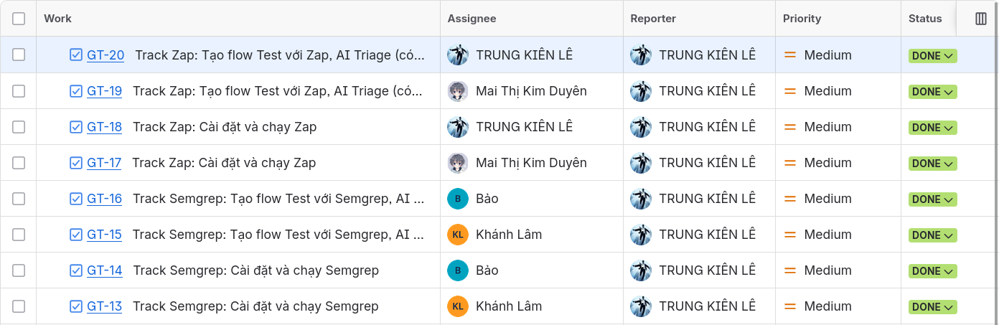

# Weekly Report - W05

## 1. Thông tin chung

- ID Nhóm: **06**
- Tên nhóm: **KDBK**
- Tên project: **T09 - Security Testing (DAST / SAST)**
- Thời gian làm: 2026-07-06 - 2026-07-11

## 2. Nhiệm vụ đã hoàn thành tuần này

### 2.1. Bảng nhiệm vụ

| **Nhiệm vụ**                                                          | **Họ tên**                   |
| :---------------------------------------------------------------------------- | :----------------------------------- |
| Track Semgrep: Cài đặt và chạy Semgrep.                                  | Lâm Hữu Khánh, Lê Mai Hoài Bảo |
| Track Semgrep: Tạo flow Test với Semgrep, AI Triage (có báo cáo output). | Lâm Hữu Khánh, Lê Mai Hoài Bảo |
| Track Zap: Cài đặt và chạy Zap.                                          | Lê Trung Kiên, Mai Thị Kim Duyên |
| Track Zap: Tạo flow Test với Zap, AI Triage (có báo cáo output).         | Lê Trung Kiên, Mai Thị Kim Duyên |

### 2.2. Minh chứng

### 2.2.1. Phân công trên Jira

- **Track Semgrep: Cài đặt và chạy Semgrep**

  - Mô tả: Chuẩn bị môi trường và chạy thử công cụ Semgrep để phục vụ kiểm thử bảo mật mã nguồn.
  - Thành viên: Lâm Hữu Khánh, Lê Mai Hoài Bảo
- **Track Semgrep: Tạo flow Test với Semgrep, AI Triage (có báo cáo output)**

  - Mô tả: Xây dựng quy trình kiểm thử bằng Semgrep và dùng AI hỗ trợ phân tích kết quả quét.
  - Thành viên: Lâm Hữu Khánh, Lê Mai Hoài Bảo
- **Track Zap: Cài đặt và chạy Zap**

  - Mô tả: Chuẩn bị môi trường và chạy thử OWASP ZAP để phục vụ kiểm thử bảo mật ứng dụng web.
  - Thành viên: Lê Trung Kiên, Mai Thị Kim Duyên
- **Track Zap: Tạo flow Test với ZAP, AI Triage (có báo cáo output)**

  - Mô tả: Xây dựng quy trình kiểm thử bằng ZAP và dùng AI hỗ trợ phân tích kết quả scan.
  - Thành viên: Lê Trung Kiên, Mai Thị Kim Duyên

### 2.2.2. Các document liên quan

Evidence tuần này gồm:

- Phần ZAP đã được đặt trong thư mục`./evidence/zap`
- Phần Semgrep đã được đặt trong thư mục`./evidence/semgrep/`

## 3. Khai báo sử dụng AI

### 3.1. Lê Trung Kiên

- Công cụ: ChatGPT, model GPT-5.5
- Prompt đã sử dụng: Yêu cầu AI hỗ trợ viết script đọc output scan OWASP ZAP, tạo báo cáo AI triage và gợi ý prompt phân tích alert/impact/PoC/fix.
- Mục đích sử dụng: Hỗ trợ xây dựng script chuyển output scan ZAP thành báo cáo AI triage.
- Nội dung AI tạo ra: Draft logic xử lý ZAP report, draft prompt gửi alert cho AI và một phần nội dung mô tả trong output triage mẫu.
- Nội dung tự thực hiện/kiểm chứng: Chỉnh sửa script để gửi API qua OpenRouter, kiểm tra luồng đọc input/xuất markdown và đối chiếu nội dung triage với evidence từ ZAP report.

### 3.2. Mai Thị Kim Duyên

- Công cụ: Gemini 3.1 Pro.
- Prompt đã sử dụng: Yêu cầu AI hỗ trợ viết mã nguồn Python để gọi API thực hiện quá trình kiểm thử tự động với OWASP ZAP. Yêu cầu AI gợi ý cách trình bày và hỗ trợ chuyển đổi và định dạng lại nội dung báo cáo về OWASP Top 10 theo cấu trúc mới.
- Mục đích sử dụng: Tự động hóa các bước gọi API của ZAP (như khởi tạo quét Spider, Active Scan và lấy kết quả) để tiết kiệm thời gian. Hỗ trợ biên tập và hoàn thiện nội dung phần báo cáo về OWASP Top 10 theo cấu trúc mới.
- Nội dung AI tạo ra: Bản nháp mã nguồn Python sử dụng thư viện `zaproxy`, kèm theo logic gọi các endpoint kiểm thử và xử lý danh sách cảnh báo (alerts) trả về. Bản nháp nội dung báo cáo OWASP Top 10 đã được chuẩn hóa định dạng.
- Nội dung tự thực hiện/kiểm chứng: Kiểm tra lại các nội dung về OWASP ZAP, tiến hành chạy thử nghiệm script thực tế hoàn toàn qua API, rà soát kết quả trả về.

### 3.3. Lâm Hữu Khánh

- Công cụ: ChatGPT / Gemini.
- Prompt đã sử dụng: Yêu cầu AI hỗ trợ rà soát phần Semgrep SAST, kiểm tra finding `hardcoded-jwt-secret`, giải thích nguy cơ hardcoded JWT secret, gợi ý PoC tạo JWT giả mạo và đề xuất hướng khắc phục bằng biến môi trường.
- Mục đích sử dụng: Hỗ trợ bước AI audit/triage cho Track Semgrep, đối chiếu cảnh báo của Semgrep với source code và đánh giá finding là True Positive hay cần thêm evidence.
- Nội dung AI tạo ra: Nhận xét sơ bộ về root cause `SECRET_KEY` bị hardcode, phân tích impact của việc lộ JWT secret, draft PoC sử dụng thư viện `jsonwebtoken`, checklist kiểm chứng rule ID/file/dòng code và gợi ý remediation dùng `process.env.JWT_SECRET`.
- Nội dung tự thực hiện/kiểm chứng: Đối chiếu output Semgrep với phần evidence trong `./evidence/semgrep/`, kiểm tra các vị trí `jwt.sign` và `jwt.verify` dùng cùng `SECRET_KEY`, rà soát PoC trước khi đưa vào báo cáo và ghi nhận rằng các finding liên quan nên được gộp thành một root cause thay vì báo thành nhiều lỗi riêng lẻ.

### 3.4. Lê Mai Hoài Bảo

- Công cụ: Google Gemini, model Gemini 3.1 Flash.
- Prompt đã sử dụng: Yêu cầu AI sửa script `semgrep_ai_triage.py` để chuyển từ thư viện cũ `google-generativeai` sang `google-genai`, xử lý lỗi gọi model và bổ sung cơ chế tự động thử lại khi Gemini API trả về lỗi 503; sau đó yêu cầu AI phân tích finding `hardcoded-jwt-secret` từ kết quả Semgrep và hỗ trợ điền `Track_A_Semgrep_Template.md`.
- Mục đích sử dụng: Khắc phục lỗi tích hợp Gemini API, tự động hóa bước AI Triage và hoàn thiện báo cáo mẫu cho Track Semgrep trên dự án EShop.
- Nội dung AI tạo ra: Bản nháp mã gọi Gemini bằng `genai.Client`, cơ chế retry khi API quá tải, báo cáo `AI_Triage_hardcoded-jwt-secret.md` gồm giải thích lỗ hổng, PoC, impact và remediation; đồng thời hỗ trợ tổng hợp Finding Note, AI Triage Note, AI Audit và Finding Report trong template Track A.
- Nội dung tự thực hiện/kiểm chứng: Cài thư viện `google-genai`, chạy lại script với `semgrep_results.json`, xác nhận script xuất được báo cáo Markdown, đối chiếu rule ID và vị trí finding với mã nguồn `backend/server.js`, kiểm tra tính hợp lý của PoC JWT và giải pháp dùng `process.env.JWT_SECRET`, sau đó rà soát và chỉnh sửa nội dung trước khi đưa vào tài liệu của nhóm.

## 4. Task tuần sau

| **Id** | **Task name**                                                                                          | **Member**                     |
| :----------: | :----------------------------------------------------------------------------------------------------------- | :----------------------------------- |
|      1      | Cài đặt và chạy cơ bản Track Zap theo hướng dẫn đã viết                                         | Lâm Hữu Khánh, Lê Mai Hoài Bảo |
|      2      | Cài đặt và chạy cơ bản Semgrep theo hướng dẫn đã viết                                          | Lê Trung Kiên, Mai Thị Kim Duyên |
|      3      | Hoàn thiện Track Semgrep trên EShop, bổ sung evidence, output scan, AI triage và ghi chú kiểm chứng. | Lâm Hữu Khánh, Lê Mai Hoài Bảo |
|      4      | Hoàn thiện Track Zap trên EShop, bổ sung evidence, output scan, AI triage và ghi chú kiểm chứng.     | Lê Trung Kiên, Mai Thị Kim Duyên |

## 5. Vấn đề phát sinh

Không có
